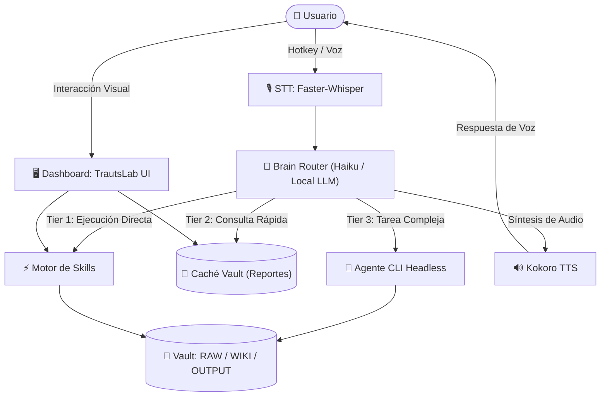

# TrautsLab OS

<div align="center">
  
  
  <h3>🧠 Centro de Comando Personal, Asistente de Voz Local y Sistema Operativo de IA</h3>

  <p>
    <b>Obsidian Command Center</b> • <b>Local Voice Engine (Faster-Whisper + Kokoro)</b> • <b>Skills & Automations</b> • <b>Karpathy Vault Memory</b>
  </p>

  <p>
    <a href="#-visión-y-características"></a>
    <a href="CHANGELOG.md"></a>
    <a href="CONTRIBUTING.md"></a>
    <a href="VERSIONING.md"></a>
  </p>
</div>

---

## 📖 Índice

- [Visión y Características](#-visión-y-características)
- [Los 4 Pilares Arquitectónicos](#-los-4-pilares-arquitectónicos)
- [Estructura del Repositorio](#-estructura-del-repositorio)
- [Documentación del Proyecto](#-documentación-del-proyecto)
- [Prototipo Frontend Interactivo](#-prototipo-frontend-interactivo)
- [Guía de Inicio Rápido](#-guía-de-inicio-rápido)
- [Control de Versiones y Contribución](#-control-de-versiones-y-contribución)
- [Licencia](#-licencia)

---

## 🌟 Visión y Características

**TrautsLab OS** transforma tu entorno de trabajo en un **Centro de Comando Operativo Proactivo** combinando:
1. **Centro de Control Visual:** Dashboard interactivo para Obsidian y navegador con monitoreo de tokens, agendas en tiempo real, KPIs y disparadores de skills.
2. **Motor de Voz Híbrido/Local de 3 Niveles:** Transcripción ultrarrápida (`Faster-Whisper`), enrutamiento inteligente (`Haiku / Local LLM`) y síntesis de voz natural (`Kokoro TTS`) accesible globalmente mediante hotkey.
3. **Backbone de Habilidades y Automatizaciones:** Codificación determinista de tareas repetitivas y rutinas matutinas desatendidas.
4. **Capa de Memoria Estructurada (Patrón Karpathy):** Navegación eficiente por índices jerárquicos en Obsidian para minimizar el consumo de tokens y maximizar la precisión de los agentes.

---

## 🏛️ Los 4 Pilares Arquitectónicos



---

## 📂 Estructura del Repositorio

```text
TrautsLab-OS/
├── docs/
│   ├── inception/
│   │   ├── 0-main-idea.md                    # Visión principal y concepto del sistema
│   │   └── 1-mobile-remote-access-and-costs.md # Acceso móvil remoto y análisis de costos
│   ├── architecture/
│   │   └── diagrams.md                       # Diagramas de arquitectura, componentes, secuencia y actividades
│   └── requirements/
│       └── use-cases.md                      # Especificación formal de Casos de Uso y Requisitos Funcionales
├── frontend/
│   ├── index.html                            # Dashboard accesible HTML5 con roles ARIA y Voice Modal
│   ├── style.css                             # Estilos modernos Glassmorphism y modo Alto Contraste
│   └── app.js                                # Lógica interactiva, simulador 3-Tier y atajos de teclado
├── CHANGELOG.md                              # Historial de versiones (Keep a Changelog)
├── CONTRIBUTING.md                           # Guía de contribución y Conventional Commits
├── VERSIONING.md                             # Política de versionado semántico (SemVer 2.0.0)
└── README.md                                 # Documento principal del repositorio
```

---

## 📚 Documentación del Proyecto

* 🗺️ **[implementation-roadmap.md](docs/roadmap/implementation-roadmap.md):** Secuencia de implementación técnica por fases (Gantt, hitos y pasos de ingeniería).
* 🧪 **[walkthrough.md](docs/testing/walkthrough.md):** Informe formal de pruebas End-to-End, métricas de latencia y benchmarks.
* 📄 **[0-main-idea.md](docs/inception/0-main-idea.md):** Concepto fundacional, comparación vs soluciones tradicionales y arquitectura de 4 pilares.
* 📱 **[1-mobile-remote-access-and-costs.md](docs/inception/1-mobile-remote-access-and-costs.md):** Guía de uso en smartphone fuera de casa (PWA, Telegram bot, túneles Tailscale/Cloudflare) y estimación de costos (~$4 - $8/mes).
* 📐 **[diagrams.md](docs/architecture/diagrams.md):** Diagramas Mermaid completos (Arquitectura, Componentes, Secuencia 3-Tier y Actividades).
* 📋 **[use-cases.md](docs/requirements/use-cases.md):** Fichas formales de especificación de Casos de Uso (UC-01 al UC-05) y Matriz de Requisitos Funcionales (RF-01 al RF-04).

---

## 🖥️ Prototipo Frontend Interactivo

El directorio `frontend/` incluye un prototipo funcional del Dashboard listo para abrirse en el navegador o integrarse en Obsidian:
* **Atajos de Teclado:**
  * `Espacio` o `V`: Abre el modal del Asistente de Voz y simula el enrutamiento de 3 niveles.
  * `1`, `2`, `3`, `4`: Navega entre las pestañas (*Overview, Daily Intel, Skills, Memory/Vault*).
  * `T`: Abre la terminal embebida inferior.
  * `Esc`: Cierra cualquier diálogo activo.
* **Accesibilidad:** Soporte para lectores de pantalla, navegación por foco visible y botón de **Modo Alto Contraste**.

---

## 🚀 Guía de Inicio Rápido

1. **Clonar el repositorio:**
   ```bash
   git clone https://github.com/trautslab/TrautsLab-OS.git
   cd TrautsLab-OS
   ```
2. **Probar el Dashboard Frontend:**
   Abre directamente `frontend/index.html` en tu navegador favorito o sírvelo localmente:
   ```bash
   npx serve frontend
   # o con Python:
   python3 -m http.server 3000 --directory frontend
   ```

---

## 🏷️ Control de Versiones y Contribución

Este proyecto sigue las pautas de:
* **[SemVer 2.0.0](VERSIONING.md)** para numeración de versiones y pre-lanzamientos (`alpha.N`, `beta.N`, `rc.N`).
* **[Keep a Changelog](CHANGELOG.md)** para la documentación de cambios.
* **[Conventional Commits](CONTRIBUTING.md)** para mensajes de confirmación claros y trazables.

---

## 👤 Autor

* **Jhonny Lorenzo** ([@jlorenzor](https://github.com/jlorenzor))
