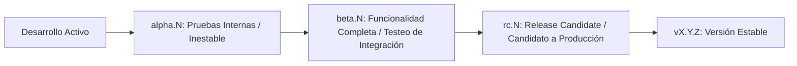

# Guía de Versionado Semántico (SemVer 2.0.0)

Este proyecto sigue estrictamente el estándar de **[Semantic Versioning 2.0.0](https://semver.org/lang/es/)** para el control de versiones de software, librerías y componentes del ecosistema **TrautsLab OS**.

---

## 1. Estructura de la Versión

El formato estándar de una versión es:

$$\text{MAJOR}.\text{MINOR}.\text{PATCH}[-\text{PRE-RELEASE}][+\text{BUILD}]$$

Ejemplo: `1.2.0-rc.1+build.20260817`

### Componentes Básicos

1. **`MAJOR` (Versión Mayor):** Se incrementa cuando se introducen cambios incompatibles en la API pública, en el formato de datos del Vault o en la arquitectura base que requieran migraciones.
2. **`MINOR` (Versión Menor):** Se incrementa cuando se añade funcionalidad compatible hacia atrás (ej. un nuevo widget en el dashboard, soporte para un nuevo motor STT, una nueva skill estándar).
3. **`PATCH` (Parche):** Se incrementa cuando se realizan correcciones de errores compatibles hacia atrás (bug fixes, ajustes de estilo o parches de seguridad).

---

## 2. Convención de Pre-Lanzamientos (*Pre-releases*)

Para fases de prueba, integración continua y despliegues experimentales, se utilizan sufijos con identificadores numéricos incrementales (`.N`):



### Ciclo de Pre-Lanzamiento

| Etiqueta | Ejemplo | Descripción | Estabilidad |
| :--- | :--- | :--- | :--- |
| **`alpha.N`** | `0.1.0-alpha.1` | Versión preliminar con funcionalidades en desarrollo activo. Puede contener APIs inestables o bugs conocidos. | Baja (Desarrollo) |
| **`beta.N`** | `0.1.0-beta.1` | *Feature-freeze* (funcionalidades completas). Enfocada en pruebas de usabilidad, integración y rendimiento. | Media (Testing) |
| **`rc.N`** | `1.0.0-rc.1` | *Release Candidate*. Candidato final para producción. Solo se admiten correcciones críticas antes del release oficial. | Alta (Pre-Release) |
| **Estable** | `1.0.0` | Versión aprobada y probada para uso diario productivo. | Producción |

---

## 3. Estrategia de Ramas (*Branching Model*)

* **`main`**: Código estable y listo para producción. Cada merge a `main` debe generar un tag de versión (`vX.Y.Z`).
* **`develop`**: Rama de integración donde conviven las versiones `alpha.N` y `beta.N`.
* **`feature/*`**: Ramas de desarrollo de nuevas funcionalidades (ej. `feature/voice-kokoro-tts`).
* **`fix/*` / `hotfix/*`**: Ramas para corrección de bugs.
* **`release/*`**: Ramas para estabilización de *Release Candidates* (ej. `release/v1.0.0-rc.1`).

---

## 4. Comandos de Versionado y Tags Git

Para crear y publicar una nueva versión:

```bash
# Ejemplo: Crear tag para versión Alpha inicial
git tag -a v0.1.0-alpha.1 -m "Release v0.1.0-alpha.1: Prototipo inicial y especificaciones de arquitectura"

# Ejemplo: Promover a Beta
git tag -a v0.1.0-beta.1 -m "Release v0.1.0-beta.1: Integración completa de voz y dashboard"

# Ejemplo: Publicar Release Candidate
git tag -a v1.0.0-rc.1 -m "Release Candidate v1.0.0-rc.1"

# Ejemplo: Versión Estable
git tag -a v1.0.0 -m "Release v1.0.0: Versión oficial estable de TrautsLab OS"

# Enviar tags a GitHub
git push origin --tags
```
