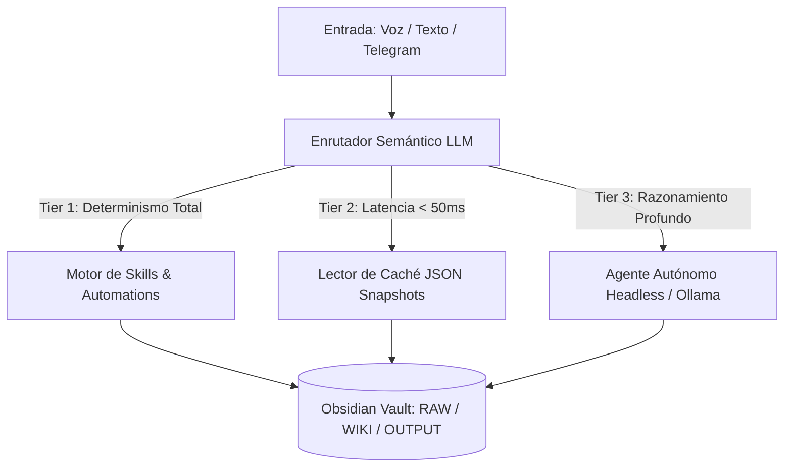

# ADR-001: Arquitectura Local-First con Obsidian Vault y Pipeline de 3 Niveles (Tiers)

> **Estado:** ACEPTADO  
> **Fecha:** 2026-08-17 (PET / UTC-5 - Hora Perú)  
> **Autores:** Jhonny Lorenzo (`jlorenzor`)  
> **Dominio:** Arquitectura del Sistema / Almacenamiento / Voz

---

## 1. Contexto y Planteamiento del Problema

Los asistentes personales y agentes de IA tradicionales sufren de tres deficiencias críticas:
1. **Dependencia de la nube y pérdida de privacidad:** El almacenamiento de datos privados en servidores externos crea riesgos de filtración y dependencia de suscripciones.
2. **Latencia y no-determinismo:** Utilizar llamadas LLM completas para tareas triviales (como consultar la hora, la agenda o disparar scripts) introduce una latencia inaceptable (> 3-5 segundos) y riesgo de alucinaciones.
3. **Explosión de consumo de tokens:** Escanear carpetas completas sin estructura agota rápidamente la ventana de contexto de los LLMs.

Se requiere una arquitectura que garantice privacidad absoluta, latencia ultra-baja en consultas frecuentes y ejecución determinista de tareas repetitivas.

---

## 2. Decisión Arquitectónica

Adoptar una arquitectura **Local-First** centrada en **Obsidian Vault (Markdown puro)** como fuente de verdad única y un **Pipeline de Ejecución de 3 Niveles (3-Tier Voice & Execution Engine)**:

### Definición de los 3 Niveles:
- **Tier 1 (Deterministic Skills Engine):** Código TypeScript ejecutable sin alucinaciones para acciones con efectos colaterales (agendar, archivar, reindexar, notificar a Telegram).
- **Tier 2 (Ultra-Fast Cache Store):** Lectura directa de snapshots JSON precalculados (`today-agenda.json`, `today-intel.json`) con latencia inferior a 50ms y cero llamadas a APIs externas.
- **Tier 3 (Headless Autonomous LLM):** Razonamiento profundo y diálogo abierto con modelos locales (`qwen2.5:3b` / `qwen2.5:7b` en Ollama) o agentes CLI.

---

## 3. Consecuencias

### Positivas:
- **Privacidad 100% local:** Todo el conocimiento reside en archivos `.md` en la máquina de Jhonny Lorenzo.
- **Velocidad inmediata:** Las consultas de agenda y noticias responden en < 50ms en Tier 2.
- **Fiabilidad determinista:** Las modificaciones en el calendario no sufren de alucinaciones del modelo.

### Negativas / Retos:
- Requiere mantener sincronizados los snapshots JSON de caché cada vez que cambia el Markdown.

---

## 4. Estrategia de Escalabilidad

1. **Sincronización multi-dispositivo:** Uso de Git / Remotely Save / Tailscale para replicar el Vault en laptops y dispositivos móviles.
2. **Caché en memoria SQLite / In-Memory KV:** Migrar snapshots JSON a SQLite embebido si el volumen de notas supera 100,000 archivos.
