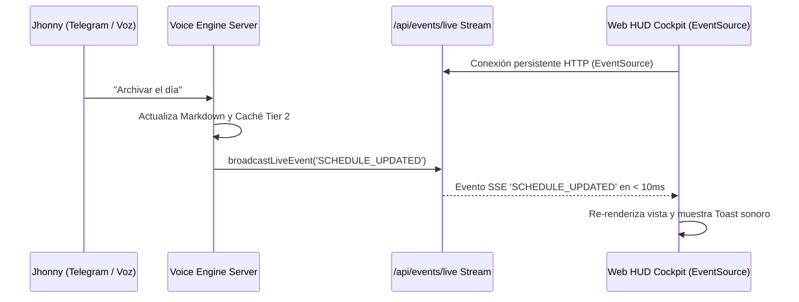

# ADR-004: Sincronización Reactiva en Tiempo Real con Server-Sent Events (SSE)

> **Estado:** ACEPTADO  
> **Fecha:** 2026-08-18 (PET / UTC-5 - Hora Perú)  
> **Autores:** Jhonny Lorenzo (`jlorenzor`)  
> **Dominio:** Frontend / Arquitectura Web / Reactividad

---

## 1. Contexto y Planteamiento del Problema

Cuando el usuario interactúa con TrautsLab OS desde Telegram (en su teléfono móvil) o ejecuta comandos por voz, las notas de Obsidian y la agenda en Markdown se actualizan de forma asíncrona en el servidor. Sin embargo, el Dashboard Web requería recargar manualmente la página (`F5`) o depender de un polling agresivo (cada segundo), lo que saturaba la red, generaba parpadeos visuales en el HUD y consumía ciclos innecesarios de CPU.

---

## 2. Decisión Arquitectónica

Implementar un flujo reactivo unidireccional en tiempo real basado en **Server-Sent Events (SSE)** en el endpoint `/api/events/live`:

### Características Técnicas:
- **Canal HTTP estándar:** No requiere protocolos pesados de WebSockets ni librerías externas.
- **Auto-reconexión nativa:** El navegador gestiona reconexiones automáticas si el servidor se reinicia.
- **Fallback pasivo de 2.5s:** En caso de corte de red, un temporizador secundario sincroniza los datos silenciosamente.

---

## 3. Consecuencias

### Positivas:
- **Latencia de actualización visual inferior a 100ms** desde el momento en que se procesa una nota de voz en Telegram.
- **Cero recargas de página** y experiencia de usuario fluida con micro-animaciones.
- Consumo mínimo de recursos en cliente y servidor.

### Negativas / Retos:
- Conexión persistente que debe ser considerada en pruebas automatizadas con Puppeteer (`waitUntil: 'domcontentloaded'`).

---

## 4. Estrategia de Escalabilidad

1. **Multiplexación de eventos:** Filtrar eventos por tópicos (`schedule`, `intel`, `logs`, `telemetry`) si se conectan múltiples pantallas o dashboards remotos.
2. **Cluster / Redis PubSub:** En caso de desplegar múltiples nodos de backend, utilizar un bus de eventos distribuido (Redis / NATS).
