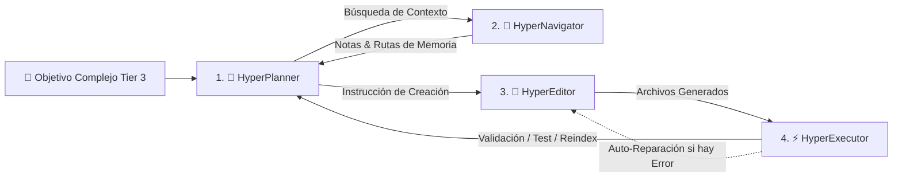

# ADR-007: Adopción del Paradigma HyperAgent (Cuadrilla Multi-Rol y Auto-Evolución) para Tareas Complejas Tier 3

> **Estado:** Aceptado  
> **Fecha:** 2026-08-19  
> **Autor:** Jhonny Lorenzo (`jlorenzor`)  
> **Estándar Horario:** `PET / UTC-5 - Hora Perú`

---

## 1. Contexto y Planteamiento del Problema

En TrautsLab OS, las intenciones de usuario se dividen en 3 niveles:
- **Tier 1:** Comandos inmediatos y habilidades deterministas (<30ms).
- **Tier 2:** Consultas de contexto rápido desde caché (<20ms).
- **Tier 3:** Tareas complejas que requieren investigación, síntesis de múltiples fuentes o creación de nuevo código y contenido.

Hasta ahora, el Tier 3 dependía de un único agente monolítico. Cuando se le encomendaban objetivos complejos (ej: *"Investiga el estado del arte de modelos de voz locales, compáralo con nuestra arquitectura y escribe un reporte estructurado en WIKI"*), un solo modelo LLM sufría sobrecarga de contexto, alucinaciones en rutas de archivos y fallos al intentar buscar, escribir y verificar simultáneamente.

---

## 2. Decisión Arquitectónica

Se decide adoptar la arquitectura **HyperAgent** basada en la descomposición de tareas complejas en **4 roles especializados y coordinados** y un bucle de auto-reparación (*Self-Repair Loop*):

### Roles y Responsabilidades:
1. **`HyperPlanner` (Estratega):** Descompone la meta en un plan estructurado de pasos con dependencias. Mantiene el árbol de estado (`PENDING`, `IN_PROGRESS`, `SUCCESS`, `FAILED`).
2. **`HyperNavigator` (Explorador de Memoria):** Utiliza el motor híbrido (`HybridSearchEngine`) y las herramientas del Vault para suministrar contexto preciso al planificador sin saturar tokens.
3. **`HyperEditor` (Redactor Quirúrgico):** Genera notas Markdown conformes a Frontmatter YAML en el Vault (`RAW/`, `WIKI/`, `OUTPUT/`) o scripts de habilidades TypeScript en `packages/skills-engine/src/skills/`.
4. **`HyperExecutor` (Verificador & Runtime):** Ejecuta scripts en sandbox, valida sintaxis, corre pruebas unitarias, ejecuta `vault-sync-indexer` y registra dinámicamente nuevas skills en caliente (*Hot-Reload*).

---

## 3. Consecuencias

### Positivas:
- **Separación de Responsabilidades (SRP):** Cada sub-agente tiene un prompt conciso y una función única y medible.
- **Reducción Drástica de Alucinaciones:** El Editor no "adivina" archivos, sino que recibe rutas exactas validadas por el Navigator.
- **Auto-Reparación (Self-Repair):** Si el Executor detecta un error de sintaxis o de API, el Editor reintenta la corrección automáticamente hasta 3 veces antes de fallar.
- **Trazabilidad Total:** Cada paso emite eventos reactivos Server-Sent Events (SSE) que se visualizan en el HUD y se registran en el ledger de observabilidad.

### Negativas / Mitigaciones:
- **Mayor número de llamadas a LLM local:** Mitigado mediante el uso de modelos locales ultrarrápidos (`qwen2.5:3b` con `keep_alive: "60m"`) y caching de contexto.
