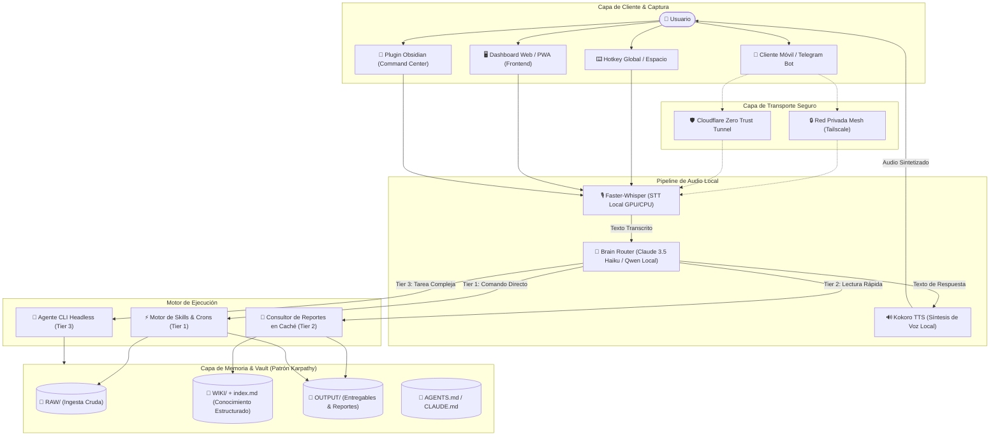
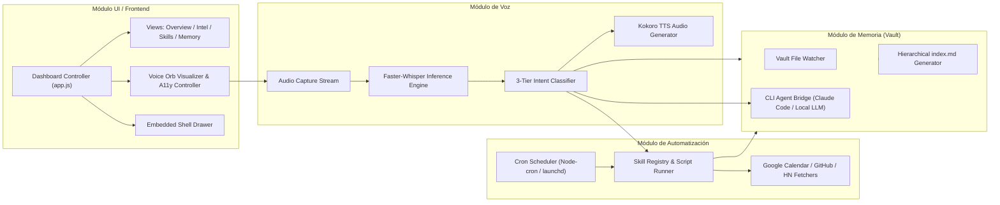
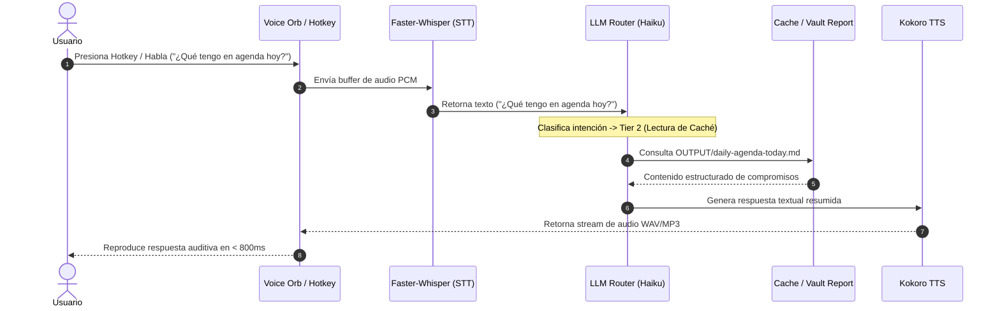
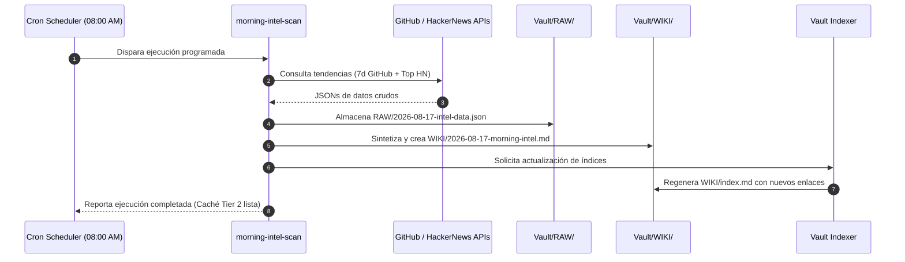
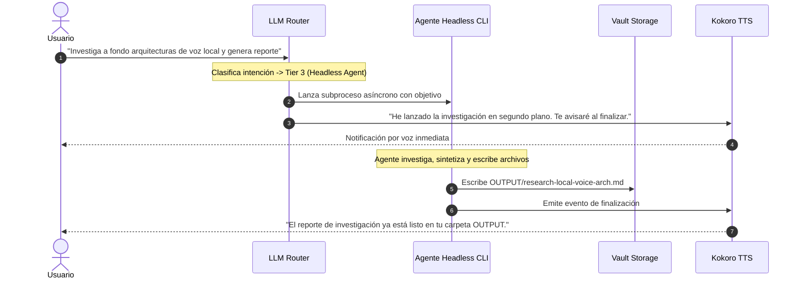
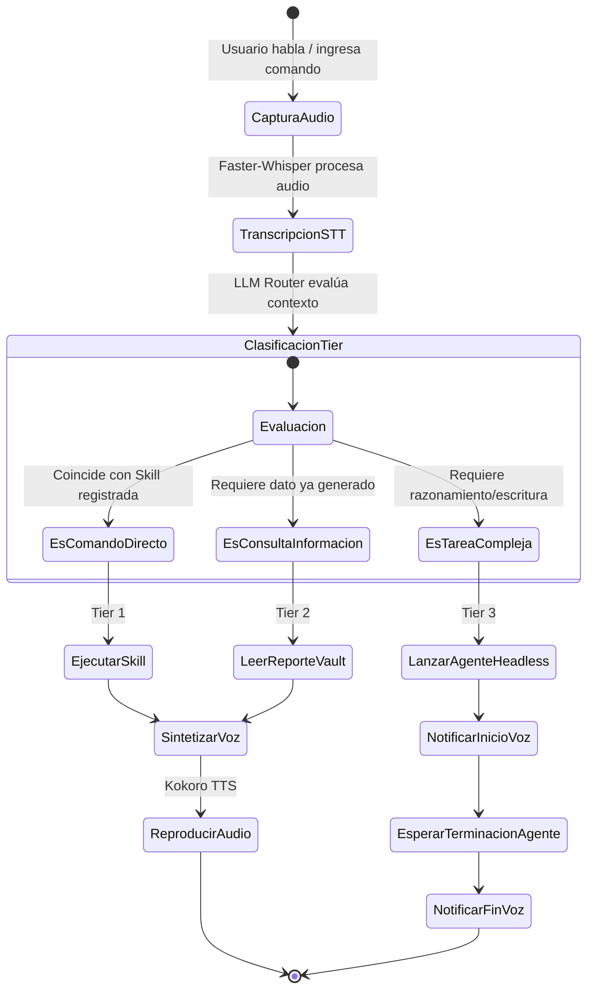
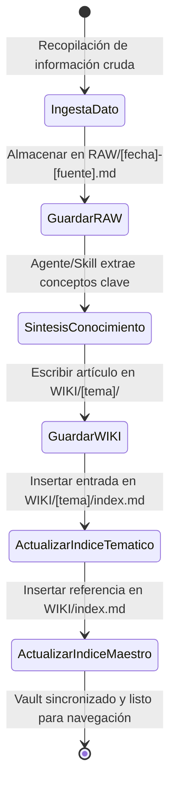

# TrautsLab OS — Diagramas de Arquitectura, Componentes, Secuencia y Actividades

> **Documento:** `docs/architecture/diagrams.md`  
> **Proyecto:** TrautsLab OS  
> **Versión:** 1.0.0-alpha.1  
> **Fecha:** 2026-08-17  

Este documento reúne las representaciones formales del sistema en **Mermaid** estructuradas en cuatro vistas arquitectónicas:
1. Diagrama de Arquitectura Global
2. Diagrama de Componentes
3. Diagramas de Secuencia (Flujo de Voz 3-Tier, Automatización Cron y Agente Headless)
4. Diagramas de Actividades

---

## 1. Diagrama de Arquitectura Global

Representa la topología de capas del sistema, desde la captura en cliente hasta el almacenamiento persistente en el Vault.

---

## 2. Diagrama de Componentes

Desglose modular de las librerías, subsistemas y dependencias de TrautsLab OS.

---

## 3. Diagramas de Secuencia

### 3.1. Flujo de Interacción por Voz y Enrutamiento 3-Tier

### 3.2. Automatización Matutina (*Daily Intel Cron*)

### 3.3. Tarea Compleja con Agente Headless (Tier 3)

---

## 4. Diagramas de Actividades

### 4.1. Flujo de Decisión del Enrutador de Intenciones

### 4.2. Ingesta y Navegación Jerárquica del Vault (Patrón Karpathy)

