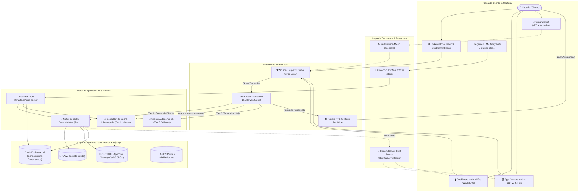

# Diagrama de Arquitectura Global y Topología de Capas

> **ID:** `ARCH-01` | **Categoría:** Topología Global  
> **Autor:** Jhonny Lorenzo (`jlorenzor`)  
> **Estándar Horario:** `PET / UTC-5 - Hora Perú`

---

## 🏛️ Topología de Capas del Sistema

Representa la interacción integral entre la capa de cliente, los túneles seguros, el pipeline de voz acelerado por Metal, el motor de ejecución 3-Tier y la capa de memoria jerárquica en el Vault:

---
[⬅️ Volver al Índice de Diagramas](./index.md)
