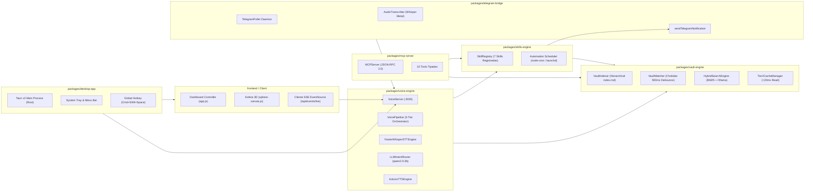

# Diagrama de Componentes del Monorepo

> **ID:** `ARCH-02` | **Categoría:** Arquitectura de Componentes  
> **Autor:** Jhonny Lorenzo (`jlorenzor`)  
> **Estándar Horario:** `PET / UTC-5 - Hora Perú`

---

## 🧩 Estructura Modular de Paquetes

Desglose modular de las dependencias y responsabilidades de los paquetes de TrautsLab OS bajo el Principio de Responsabilidad Única (SRP):

---
[⬅️ Volver al Índice de Diagramas](./index.md)
