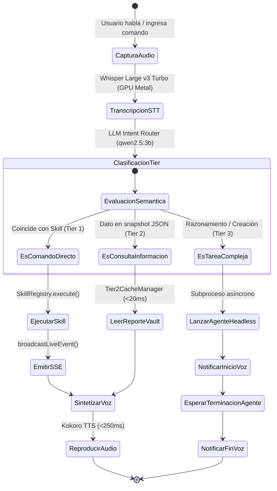

# Diagrama de Actividades: Flujo de Decisión del Enrutador Semántico LLM

> **ID:** `ACT-01` | **Categoría:** Diagramas de Actividades y Estados  
> **Autor:** Jhonny Lorenzo (`jlorenzor`)  
> **Estándar Horario:** `PET / UTC-5 - Hora Perú`

---

## ⚙️ Diagrama de Estados y Decisión

---
[⬅️ Volver al Índice de Diagramas](../index.md)
