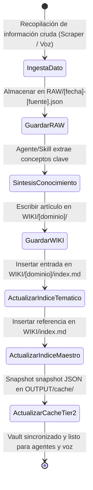

# Diagrama de Actividades: Ciclo de Vida de Ingesta y Navegación del Vault (Patrón Karpathy)

> **ID:** `ACT-02` | **Categoría:** Diagramas de Actividades y Estados  
> **Autor:** Jhonny Lorenzo (`jlorenzor`)  
> **Estándar Horario:** `PET / UTC-5 - Hora Perú`

---

## ⚙️ Diagrama del Ciclo de Vida de Conocimiento

---
[⬅️ Volver al Índice de Diagramas](../index.md)
