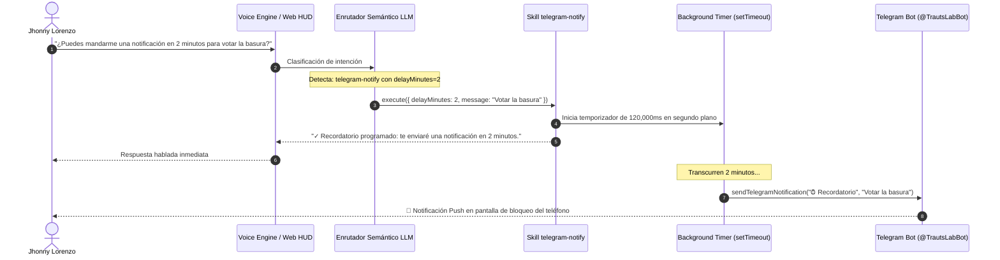

# Diagrama de Secuencia: Notificaciones Push y Temporizadores Diferidos (`telegram-notify`)

> **ID:** `SEQ-06` | **Categoría:** Diagramas de Secuencia  
> **Autor:** Jhonny Lorenzo (`jlorenzor`)  
> **Estándar Horario:** `PET / UTC-5 - Hora Perú`

---

## 🔄 Flujo de Ejecución

---
[⬅️ Volver al Índice de Diagramas](../index.md)
