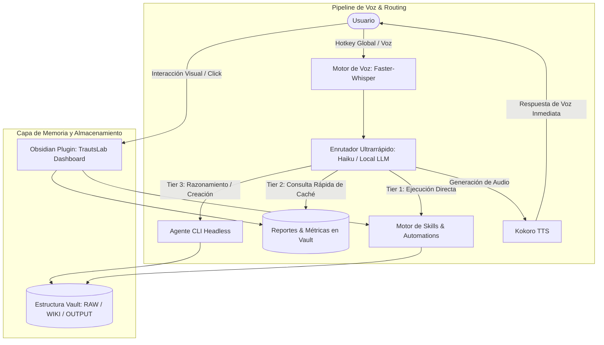

# TrautsLab OS: Concepto, Arquitectura y Visión Principal

> **Documento:** `docs/inception/0-main-idea.md`  
> **Proyecto:** TrautsLab OS *(Nombres alternativos considerados: Trauts Command Center, Trauts Core, Nexus OS)*  
> **Estado:** Fase de Incepción / Ideación Inicial  
> **Fecha y Hora:** 2026-08-17 09:37:44 (PET / UTC-5 - Hora Perú)  

---

## 1. Resumen Ejecutivo y Visión

**TrautsLab OS** es un **Centro de Comando Operativo Personal y Sistema de Inteligencia Aumentada** diseñado para unificar la interacción con agentes de Inteligencia Artificial (CLI / Claude Code / LLMs locales), interfaces visuales interactivas en **Obsidian**, y capacidades de **voz local e híbrida en tiempo real**.

A diferencia de un simple visor de notas o una terminal aislada, TrautsLab OS actúa como un **sistema operativo contextual y proactivo** que:
1. **Visualiza** métricas, agendas, reportes y estado del sistema en un Dashboard de Obsidian 100% personalizable.
2. **Interactúa por Voz** con mínima latencia y hotkey global (dentro o fuera de la app) mediante una arquitectura de 3 niveles (*Tiers*).
3. **Estandariza y Ejecuta Habilidades (Skills)** codificadas para eliminar el no-determinismo de la IA en tareas recurrentes.
4. **Organiza y Navega el Conocimiento (Vault)** bajo el patrón de mapas jerárquicos (estilo Karpathy), reduciendo el consumo de tokens y acelerando el tiempo de respuesta.

---

## 2. Diagrama de Arquitectura General



---

## 3. Los Cuatro Pilares Fundamentales

### Pilar 1: Capa Visual / Centro de Control (Obsidian Plugin)
Una interfaz gráfica interactiva construida como un plugin custom para Obsidian que sirve de cuadro de mando central.

* **Widgets y Vistas Clave:**
  * **Métricas Operativas / KPIs:** Monitor de consumo de tokens, analíticas de canales o proyectos.
  * **Agenda Inteligente:** Sincronización con calendario (ej. Google Calendar) con desglose de compromisos y tareas prioritarias.
  * **Pestañas de Reportes Matutinos (Daily Intel):**
    * *Investigación:* Repositorios tendencia (GitHub 7d/30d), debates en Hacker News, vídeos destacados.
    * *Audiencia & Rendimiento:* Estado y analíticas de proyectos o contenidos.
  * **Botonera de Skills:** Disparadores visuales de un solo clic para ejecutar rutinas.
  * **Terminal Integrada:** Consola accesible directamente sin abandonar la vista del dashboard.
* **Experiencia de Usuario (UI/UX):**
  * Diseño moderno (Glassmorphism, modo oscuro estilizado, micro-animaciones de datos).
  * Desarrollo acelerado mediante plugins complementarios como **Hot Reload**.

---

### Pilar 2: Arquitectura de Voz Híbrida / Local de 3 Niveles
Un asistente de voz siempre disponible mediante hotkey global, capaz de responder de inmediato sin interrumpir el flujo de trabajo.

* **Pipeline de Audio:**
  * **STT (Speech-to-Text):** `Faster-Whisper` ejecutándose localmente (GPU/CPU).
  * **Router (Cerebro de Enrutamiento):** Modelo ligero y de baja latencia (Claude 3.5 Haiku o LLM local estilo Qwen) que clasifica la intención en 3 niveles.
  * **TTS (Text-to-Speech):** `Kokoro TTS` para síntesis de voz natural, abierta y de alta velocidad.

* **Los 3 Niveles de Enrutamiento (Routing Tiers):**
  1. **Tier 1 — Skills / Comandos Directos:** Disparo de scripts predefinidos sin necesidad de procesamiento adicional (ej. *"Ejecuta el escaneo de inteligencia matutino"*).
  2. **Tier 2 — Consultas Rápidas de Caché & Reportes (Lectura):** Acceso inmediato a reportes y resúmenes que ya fueron pre-generados en el Vault (ej. *"¿Qué es lo más importante en mi agenda hoy?"* o *"¿Cuál es la noticia principal de IA?"*). Cero latencia de búsqueda web externa.
  3. **Tier 3 — Tareas Complejas / Headless Agent (Escritura / Razonamiento):** Acciones que requieren investigación profunda, planificación o modificaciones de código. El sistema dispara una instancia desatendida (*headless*) del agente y notifica al usuario cuando concluye.

---

### Pilar 3: Backbone de Habilidades (Skills) y Automatizaciones
El núcleo operativo: codificar tareas repetitivas en procedimientos deterministas y reproducibles.

* **Dominios Típicos:**
  * *Productividad & Memoria:* Agenda, briefs diarios, gestión de prioridades.
  * *Investigación (Research Pipeline):* Escaneo de tendencias, resumen de competidores, ingesta de papers y artículos.
  * *Contenido & Operaciones:* Guiones, métricas, seguimiento y reportes de estado.
* **Metodología para Descubrir y Codificar Skills:**
  1. **Stream of Consciousness:** Grabación de audio / conversación abierta explicando la rutina diaria/semanal para que el agente extraiga candidatos a skills.
  2. **Log Mining:** Análisis de los logs históricos de uso del agente (últimos 30-90 días) para identificar qué tareas se repiten con mayor frecuencia en la práctica.
  3. **Enfoque Híbrido:** Combinación de intención consciente con datos reales de ejecución.
* **Ciclo de Vida de una Habilidad:**
  $$\text{Idea} \longrightarrow \text{Skill Manual (Testeo \& Refinamiento)} \longrightarrow \text{Automatización / Cron (Desatendida)} \longrightarrow \text{Self-improving Loop (Evaluación)}$$

---

### Pilar 4: Capa de Memoria y Navegación ("Karpathy Vault Pattern")
El Vault de Obsidian actúa como un **mapa estructurado de archivos Markdown** optimizado tanto para lectura humana como para navegación algorítmica por parte de los agentes.

* **Estructura Estándar de Carpetas:**
  ```text
  TrautsLab-Vault/
  ├── RAW/                  # Ingesta cruda: artículos, transcripciones, datos sin procesar.
  ├── WIKI/                 # Conocimiento sintetizado y estructurado temáticamente.
  │   ├── index.md          # Tabla de contenidos maestra.
  │   └── [Tema]/index.md   # Índices temáticos de segundo nivel.
  ├── OUTPUT/               # Entregables finales: reportes, presentaciones, documentos listos.
  └── AGENTS.md / CLAUDE.md # Mapa del sistema e instrucciones de navegación para agentes.
  ```
* **El Principio del Índice Jerárquico (`index.md`):**
  * Cada nivel de carpetas cuenta con un archivo índice que funciona como tabla de contenidos.
  * Los agentes navegan consultando primero los índices de alto nivel y descendiendo únicamente a los archivos necesarios, **maximizando la precisión y minimizando el gasto de tokens**.

---

## 4. Stack Tecnológico Base Recomendado

| Componente | Tecnología Seleccionada | Alternativas Evaluables |
| :--- | :--- | :--- |
| **Interfaz / Dashboard** | Obsidian Custom Plugin (TypeScript / Vanilla CSS / React) | Canvas / Web standalone wrapper |
| **STT (Entrada de Voz)** | `Faster-Whisper` (Local) | Whisper.cpp / Cloud Whisper API |
| **Router LLM** | Claude 3.5 Haiku | Qwen 2.5 / Llama 3 local |
| **TTS (Salida de Voz)** | `Kokoro TTS` (Local / Open-Source) | Piper TTS / ElevenLabs |
| **Agente CLI / Execution** | Claude Code / GABA Agent CLI / Antigravity Agent | Custom Python / TS Agent Runner |
| **Almacenamiento & Memoria**| Markdown Files + JSON Caches (Obsidian Vault) | SQLite / LanceDB / LightRAG |

---

## 5. Roadmap de Implementación Sugerido

```text
Fase 1: Incepción y Definición (Actual)
  ├── 0-main-idea.md (Visión y Arquitectura)
  ├── Definición de Dominios de Trabajo del Usuario
  └── Diseño de la Estructura del Vault y Reglas de Navegación

Fase 2: Motor de Skills y Primeras Rutinas
  ├── Identificación de las primeras 2-3 Skills críticas
  ├── Implementación de scripts de extracción (ej. Daily Intel, Calendar Brief)
  └── Automatización / Programación de ejecución matutina (Caché Tier 2)

Fase 3: Pipeline de Voz y Routing
  ├── Configuración local STT (Faster-Whisper) + TTS (Kokoro)
  ├── Implementación del Enrutador de 3 Niveles (Tier 1, 2, 3)
  └── Integración de Hotkey Global fuera de Obsidian

Fase 4: Plugin Obsidian (Dashboard Visual)
  ├── Setup del plugin con soporte Hot Reload
  ├── Implementación de Widgets (KPIs, Agenda, Intel, Botonera)
  └── Integración de Terminal y refinamiento visual (Glassmorphism UI)
```
