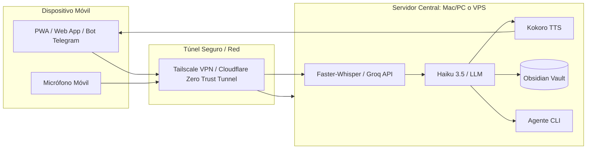

# TrautsLab OS: Acceso Móvil Fuera de Casa & Evaluación de Costos

> **Documento:** `docs/inception/1-mobile-remote-access-and-costs.md`  
> **Tema:** Uso móvil como Asistente de Vida Diaria y Análisis de Costos  
> **Fecha y Hora:** 2026-08-17 09:55:25 (PET / UTC-5 - Hora Perú)  

---

## 1. ¿Es posible usarlo en el celular fuera de casa como Asistente Diario?

**Sí, es 100% viable.** Puedes interactuar con TrautsLab OS desde tu smartphone mientras caminas, viajas o estás en el trabajo, manteniendo el cerebro y la memoria centralizados en tu equipo o en la nube.

---

## 2. ¿Qué se necesita hacer para lograrlo? (Arquitectura Móvil)

Para tener a TrautsLab OS en el móvil fuera de casa, se requieren **3 capas**:

### Capa A: El Canal de Interacción Móvil (Frontend)
1. **PWA (Progressive Web App):** 
   - El frontend que acabamos de diseñar (`frontend/index.html`) se puede instalar en la pantalla de inicio de iOS/Android como una app nativa.
   - Cuenta con botón flotante tipo "Walkie-Talkie" / Voice Orb para enviar audio directo al backend.
2. **Puente Conversacional Ligero (Telegram / WhatsApp Bot):**
   - Ideal para cuando estás en la calle con ruido o mala cobertura: mandas notas de voz o mensajes de texto a un bot privado de Telegram conectado a TrautsLab OS.
3. **Obsidian Mobile:**
   - La app oficial de Obsidian en el móvil sincronizada (vía Git, Remotely Save o Obsidian Sync) para consultar tus notas, diarios y reportes generados.

### Capa B: El Túnel Seguro (Sin abrir puertos inseguros)
* **Opción 1: Tailscale (Recomendada):** Red privada virtual (VPN mesh) gratuita que conecta tu móvil a tu Mac de casa con encriptación punto a punto instantánea.
* **Opción 2: Cloudflare Zero Trust Tunnel (Gratuito):** Permite exponer tu servidor web bajo un subdominio seguro (ej. `os.tu-dominio.com`) protegido con autenticación de Google/Apple.

### Capa C: Motor de Voz Móvil (Latencia en Roaming)
* Al estar con datos móviles (4G/5G), puedes enviar el audio grabado en el móvil a tu Mac en casa (donde corre `Faster-Whisper` y `Kokoro`), o usar un endpoint ultrarrápido de bajo coste (como la API de Groq Whisper que transcribe en menos de 200ms).

---

## 3. Evaluación Detallada de Costos

Analizamos tres escenarios operativos según tus preferencias de infraestructura:

| Concepto | Escenario 1: Self-Hosted Local (Mac en Casa) | Escenario 2: Híbrido Recomendado (Mac + APIs Rápidas) | Escenario 3: 100% Cloud VPS Dedicado |
| :--- | :--- | :--- | :--- |
| **Infraestructura / Servidor** | **$0** (Tu Mac actual con Mac Mini/MacBook encendido) | **$0** (Tu Mac actual) | **$25 - $50/mes** (VPS con GPU en Hetzner / RunPod) |
| **Conexión Remota (Túnel)** | **$0** (Tailscale / Cloudflare Tunnel) | **$0** (Tailscale / Cloudflare Tunnel) | **$0** (IP pública segura) |
| **STT (Audio a Texto)** | **$0** (Faster-Whisper local) | **$0.10 - $0.50/mes** (Groq Whisper @ $0.0001/min) | **$0** (Whisper en GPU Cloud) |
| **Router LLM (Haiku 3.5)** | **$1.00 - $3.00/mes** (~500 consultas diarias) | **$1.00 - $3.00/mes** | **$1.00 - $3.00/mes** (o $0 con LLM local) |
| **TTS (Voz de Salida)** | **$0** (Kokoro TTS local) | **$0** (Kokoro local en Mac) | **$0** (Kokoro en Cloud) |
| **Consumo Eléctrico Mac** | **~$2 - $4/mes** (Mac en reposo/idle) | **~$2 - $4/mes** | **$0** |
| **COSTO TOTAL ESTIMADO** | **~$3 - $7 / mes** | **~$4 - $8 / mes** | **~$30 - $60 / mes** |

---

## 4. Conclusión y Recomendación para el Uso Diario

* **Factibilidad:** Totalmente accesible y funcional.
* **Costo mensual real:** **Menos de $8 USD al mes** (en el modelo híbrido o self-hosted local con Tailscale y Claude 3.5 Haiku).
* **Experiencia de usuario móvil:**
  - Tienes acceso visual al Dashboard en el navegador del móvil como PWA.
  - Tienes interacción por voz instantánea pulsando el Orb o enviando notas de voz a tu bot de Telegram.
  - Toda la memoria y reportes se guardan directamente en tu Obsidian Vault.
