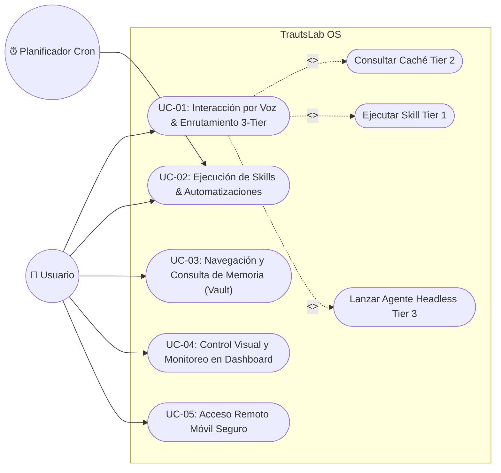

# TrautsLab OS — Especificación de Casos de Uso y Requisitos Funcionales

> **Documento:** `docs/requirements/use-cases.md`  
> **Proyecto:** TrautsLab OS  
> **Versión:** 1.0  
> **Autor/a:** jlorenzor  
> **Fecha y Hora:** 2026-08-17 10:43:08 (PET / UTC-5 - Hora Perú)  

---

## 1. Diagrama General de Casos de Uso del Sistema



---

## 2. Fichas de Especificación de Casos de Uso (Formato Estándar)

### CASO DE USO: UC-01 — Interacción por Voz y Enrutamiento Inteligente

| CASO DE USO: Interacción por Voz y Enrutamiento Inteligente | | | |
| :--- | :--- | :--- | :--- |
| **Versión** | 1.0 | **Fecha** | 2026-08-17 |
| **Autor/a** | jlorenzor | | |
| **Descripción** | Describe cómo el usuario interactúa mediante comandos de voz desde cualquier aplicación o desde el dashboard para obtener respuestas inmediatas, ejecutar skills o delegar tareas complejas mediante un enrutador inteligente de 3 niveles. |
| **Actores** | Usuario |
| **Precondición** | El demonio de `Faster-Whisper` y el motor `Kokoro TTS` deben estar activos y el micrófono del sistema debe estar habilitado. |
| **Flujo principal** | 1. El usuario presiona el *hotkey global* (o pulsa el *Voice Orb* en el dashboard) y pronuncia un comando o consulta.<br>2. El motor `Faster-Whisper` captura y transcribe el audio a texto con baja latencia.<br>3. El enrutador LLM analiza el texto y clasifica la intención en uno de los 3 niveles (*Tier 1: Skill, Tier 2: Caché, Tier 3: Headless Agent*).<br>4. Si es Tier 2, el sistema consulta el archivo de reporte pre-generado en el Vault.<br>5. El sistema sintetiza la respuesta mediante `Kokoro TTS` y reproduce el audio al usuario.<br>6. El sistema muestra la transcripción y el estado de enrutamiento en la interfaz. |
| **Subflujos** | - **Subflujo A (Tier 1):** Si el comando corresponde a una skill registrada, el sistema dispara el script y confirma la ejecución.<br>- **Subflujo B (Tier 3):** Si la solicitud es compleja, el sistema lanza un subagente CLI en segundo plano y notifica por voz que el proceso ha iniciado. |
| **Flujos alternativos** | - **Audio inaudible o silencio:** El sistema detecta ausencia de voz y muestra el mensaje *"No se detectó audio comprensible"*, cerrando la sesión de escucha.<br>- **Fallo de conectividad en Router:** Si el modelo LLM no responde, se recurre al motor local de fallback. |
| **Postcondición** | La consulta es respondida de forma auditiva y visual, y la actividad queda registrada en el log de auditoría. |
| **Diagrama** | ```mermaid<br>graph LR<br>  User((👤 Usuario)) --> UC1["Interacción por Voz"]<br>  UC1 -.->|<<extend>>| T1["Tier 1: Disparo de Skill"]<br>  UC1 -.->|<<extend>>| T2["Tier 2: Lectura de Caché"]<br>  UC1 -.->|<<extend>>| T3["Tier 3: Agente Headless"]<br>``` |

---

### CASO DE USO: UC-02 — Ejecución de Skills y Automatizaciones Programadas

| CASO DE USO: Ejecución de Skills y Automatizaciones Programadas | | | |
| :--- | :--- | :--- | :--- |
| **Versión** | 1.0 | **Fecha** | 2026-08-17 |
| **Autor/a** | jlorenzor | | |
| **Descripción** | Describe la ejecución manual o desatendida (*cron*) de procedimientos deterministas codificados para extraer inteligencia, sincronizar calendarios o actualizar índices. |
| **Actores** | Usuario, Planificador Cron |
| **Precondición** | Las *skills* deben estar registradas con sus scripts correspondientes y credenciales de acceso a APIs externas si aplica. |
| **Flujo principal** | 1. El usuario hace clic en el botón de la skill en el dashboard (o el planificador cron alcanza la hora fijada, ej. 08:00 AM).<br>2. El sistema valida los parámetros de entrada y dispara el script de la skill.<br>3. La skill recopila información de fuentes externas (GitHub, Google Calendar, Hacker News).<br>4. La skill almacena los datos brutos en `Vault/RAW/` y sintetiza los reportes en `Vault/WIKI/` y `Vault/OUTPUT/`.<br>5. El indexador actualiza la tabla de contenidos en `index.md`.<br>6. El dashboard actualiza los widgets visuales y la caché de Tier 2 queda lista. |
| **Subflujos** | - |
| **Flujos alternativos** | - **Error en API externa:** Si una fuente no está disponible, la skill utiliza los últimos datos válidos en caché y registra una advertencia en el log de ejecución. |
| **Postcondición** | Los reportes están disponibles en el Vault de Obsidian y los widgets del dashboard reflejan los nuevos datos. |
| **Diagrama** | ```mermaid<br>graph LR<br>  Cron((⏰ Planificador)) --> UC2["Ejecutar Skill Matutina"]<br>  User((👤 Usuario)) --> UC2<br>  UC2 --> Ingesta["Ingestar en RAW/"]<br>  UC2 --> Sintesis["Sintetizar en WIKI/"]<br>  UC2 --> Cache["Actualizar Caché Tier 2"]<br>``` |

---

### CASO DE USO: UC-03 — Navegación y Consulta de Memoria en Vault

| CASO DE USO: Navegación y Consulta de Memoria en Vault | | | |
| :--- | :--- | :--- | :--- |
| **Versión** | 1.0 | **Fecha** | 2026-08-17 |
| **Autor/a** | jlorenzor | | |
| **Descripción** | Describe cómo un usuario o un agente autónomo navega por la jerarquía de notas del Vault utilizando el mapa maestro `AGENTS.md` e índices jerárquicos `index.md` para recuperar información sin consumir tokens excesivos. |
| **Actores** | Usuario, Agente CLI |
| **Precondición** | El Vault debe seguir la estructura `RAW/`, `WIKI/`, `OUTPUT/` con sus respectivos archivos `index.md`. |
| **Flujo principal** | 1. El actor solicita buscar un dato o concepto específico.<br>2. El sistema lee el índice temático de nivel superior en `WIKI/index.md`.<br>3. El sistema identifica la subcarpeta pertinente y desciende al archivo específico requerido.<br>4. Se extrae la respuesta y se presenta al actor.<br>5. Si la información no existe, se consulta el registro en `RAW/` para determinar si requiere síntesis. |
| **Subflujos** | - |
| **Flujos alternativos** | - **Índice desactualizado:** Si se detectan archivos huérfanos sin indexar, se dispara automáticamente la skill `vault-indexer`. |
| **Postcondición** | La consulta se resuelve con un consumo mínimo de tokens (< 500 tokens por consulta vs > 50,000 en escaneo ciego). |
| **Diagrama** | ```mermaid<br>graph LR<br>  Agent((🤖 Agente / Usuario)) --> UC3["Consultar Memoria Vault"]<br>  UC3 --> Index["Leer WIKI/index.md"]<br>  Index --> File["Acceso Directo al Archivo"]<br>``` |

---

### CASO DE USO: UC-06 — Observación en Tiempo Real e Indexación Incremental del Vault

| CASO DE USO: Observación en Tiempo Real e Indexación Incremental del Vault | | | |
| :--- | :--- | :--- | :--- |
| **Versión** | 1.0 | **Fecha** | 2026-08-17 |
| **Autor/a** | jlorenzor | | |
| **Descripción** | Describe cómo el demonio observador de archivos (*Vault Watcher*) detecta de forma desatendida cualquier adición, edición o eliminación de notas markdown en el Vault y ejecuta una re-indexación jerárquica con debounce para mantener el mapa de navegación siempre sincronizado. |
| **Actores** | Sistema / File Watcher Daemon, Usuario, Agente CLI |
| **Precondición** | El proceso demonio `vault-watcher` debe estar en ejecución en background. |
| **Flujo principal** | 1. El usuario o un agente crea o modifica un archivo markdown en `RAW/`, `WIKI/` o `OUTPUT/`.<br>2. El demonio `vault-watcher` captura el evento del sistema de archivos (*FS event*).<br>3. El sistema aplica una ventana de retardo (*debounce* de 500ms) para agrupar modificaciones continuas.<br>4. El analizador de frontmatter extrae metadatos (título, descripción, tags, fecha).<br>5. El generador de índices actualiza el `index.md` del directorio afectado y el `index.md` raíz.<br>6. El almacén de caché de Tier 2 actualiza sus referencias instantáneas.<br>7. Se emite un registro de confirmación en la consola de eventos. |
| **Subflujos** | - |
| **Flujos alternativos** | - **Archivo con sintaxis frontmatter corrupta:** El sistema registra una advertencia en el linter, utiliza el nombre de archivo como título de respaldo y continúa la indexación sin detener el proceso. |
| **Postcondición** | El mapa de navegación (`AGENTS.md` e `index.md`) queda 100% fiel al estado real de los archivos sin intervención manual. |
| **Diagrama** | ```mermaid<br>graph LR<br>  Watcher((👁️ Vault Watcher)) --> Event["Detectar Cambio FS"]<br>  Event --> Debounce["Debounce 500ms"]<br>  Debounce --> Parse["Extraer YAML Frontmatter"]<br>  Parse --> Update["Regenerar index.md"]<br>  Update --> Cache["Actualizar Tier 2 Cache"]<br>``` |

---

## 3. Especificación de Requisitos Funcionales (Matriz RF)

### RF-01: Control de Acceso y Gestión de Sesión

| RF-01 | Acceso y Seguridad de la Aplicación |
| :--- | :--- |
| **Versión** | Versión 1.0 |
| **Autores** | jlorenzor |
| **Objetivos Asociados** | OBJ-01: Acceso Seguro y Soberanía de Datos en TrautsLab OS |
| **Requisitos asociados** | RI-01: Información de Seguridad y Configuración de Túnel |
| **Descripción** | El sistema deberá validar la autenticidad y autorización del usuario cuando intente acceder al dashboard o enviar comandos de voz, tanto localmente como de forma remota. |
| **Precondición** | El usuario debe estar conectado a la red local autenticada o disponer del certificado/túnel seguro (Tailscale / Cloudflare Zero Trust) activo. |
| **Secuencia normal** | **Paso** \| **Acción**<br>1 \| El usuario abre la interfaz de TrautsLab OS (local o PWA móvil).<br>2 \| El sistema verifica la sesión activa o el token de acceso seguro del túnel.<br>3 \| Si la sesión es válida, el sistema carga el Dashboard Command Center con el estado `ONLINE (LOCAL GPU)`.<br>4 \| El sistema inicializa los escuchadores de teclado y atajos de voz. |
| **Excepciones** | **Paso** \| **Acción**<br>2 \| Si el token de acceso es inválido o no hay conexión con el Core: el sistema muestra pantalla de desconexión y opción de reintentar conexión con el host local. |
| **Postcondición** | El usuario accede al panel de control con todas las capacidades habilitadas. |
| **Importancia** | Vital. |
| **Urgencia** | Inmediatamente. |
| **Comentarios** | Para acceso local en la misma máquina no se requiere login redundante; para acceso web remoto se aplica autenticación por túnel. |

---

### RF-02: Procesamiento y Enrutamiento de Voz en Tiempo Real

| RF-02 | Captura de Voz, Transcripción y Enrutador 3-Tier |
| :--- | :--- |
| **Versión** | Versión 1.0 |
| **Autores** | jlorenzor |
| **Objetivos Asociados** | OBJ-02: Interacción por Voz con Mínima Latencia (< 1s en Tier 2) |
| **Requisitos asociados** | RI-02: Parámetros del Motor de Audio y Modelos STT/TTS |
| **Descripción** | El sistema deberá capturar audio vía micrófono, transcribirlo con Faster-Whisper, clasificar la intención con un LLM enrutador y generar respuesta en audio con Kokoro TTS. |
| **Precondición** | Motores de audio inicializados en GPU o CPU local. |
| **Secuencia normal** | **Paso** \| **Acción**<br>1 \| El usuario activa la captura de audio vía hotkey o pulsación del Voice Orb.<br>2 \| El sistema graba el stream de audio hasta detectar silencio o liberación de tecla.<br>3 \| El motor `Faster-Whisper` transcribe el audio a texto.<br>4 \| El Enrutador clasifica la solicitud en Tier 1, 2 o 3.<br>5 \| El sistema ejecuta la acción correspondiente y genera la respuesta textual.<br>6 \| El motor `Kokoro TTS` sintetiza la respuesta y el cliente la reproduce. |
| **Excepciones** | **Paso** \| **Acción**<br>3 \| Si la transcripción falla por nivel de ruido excesivo, el sistema emite un tono sutil y solicita confirmación.<br>4 \| Si la solicitud excede el ámbito de Tier 2, el sistema la promueve automáticamente a Tier 3 (Headless Agent). |
| **Postcondición** | La acción es ejecutada y el usuario recibe confirmación auditiva instantánea. |
| **Importancia** | Vital. |
| **Urgencia** | Inmediatamente. |
| **Comentarios** | La latencia de extremo a extremo para consultas de Tier 2 debe mantenerse por debajo de los 900 milisegundos. |

---

### RF-03: Automatización y Sincronización Matutina (*Daily Intel*)

| RF-03 | Generación Automatizada de Reportes de Inteligencia |
| :--- | :--- |
| **Versión** | Versión 1.0 |
| **Autores** | jlorenzor |
| **Objetivos Asociados** | OBJ-03: Información Proactiva y Actualización Continua del Vault |
| **Requisitos asociados** | RI-03: Conectores a APIs de GitHub, Hacker News y Google Calendar |
| **Descripción** | El sistema deberá ejecutar periódicamente tareas desatendidas para recopilar noticias, repositorios tendencia y eventos de calendario, escribiendo los resultados en el Vault. |
| **Precondición** | Servicio de cron activo y conexión a internet disponible. |
| **Secuencia normal** | **Paso** \| **Acción**<br>1 \| El planificador cron activa el trigger a las 08:00 AM.<br>2 \| El sistema ejecuta la skill `morning-intel-scan`.<br>3 \| Se descargan las métricas y tendencias de las APIs configuradas.<br>4 \| Se formatea el contenido en Markdown y se guarda en `Vault/WIKI/` y `Vault/OUTPUT/`.<br>5 \| Se actualiza el archivo `WIKI/index.md` con los enlaces del nuevo reporte.<br>6 \| Se actualiza la memoria en caché para consultas de voz Tier 2. |
| **Excepciones** | **Paso** \| **Acción**<br>3 \| Si falla la conexión a internet, se registra el fallo en el log y se reintenta a los 15 minutos. |
| **Postcondición** | Los reportes diarios quedan disponibles en Obsidian antes del inicio de la jornada laboral. |
| **Importancia** | Alta. |
| **Urgencia** | Alta. |
| **Comentarios** | Permite que las consultas de voz sobre noticias o agenda respondan en milisegundos sin hacer consultas web en vivo. |

---

### RF-04: Navegación Eficiente y Mapeo Jerárquico del Vault

| RF-04 | Indexación y Navegación Jerárquica del Vault |
| :--- | :--- |
| **Versión** | Versión 1.0 |
| **Autores** | jlorenzor |
| **Objetivos Asociados** | OBJ-04: Optimización del Consumo de Tokens y Estructura Karpathy |
| **Requisitos asociados** | RI-04: Estructura de Directorios RAW, WIKI, OUTPUT |
| **Descripción** | El sistema deberá mantener archivos `index.md` actualizados en cada nivel de carpetas del Vault para que tanto humanos como agentes naveguen guiados por tablas de contenido. |
| **Precondición** | El directorio raíz del Vault debe contener `AGENTS.md` o `CLAUDE.md`. |
| **Secuencia normal** | **Paso** \| **Acción**<br>1 \| Un archivo nuevo es creado o modificado en el Vault.<br>2 \| El observador de archivos (*file watcher*) detecta el cambio.<br>3 \| Se ejecuta `vault-indexer` para registrar el nuevo archivo en el `index.md` de su carpeta.<br>4 \| Si se crea una nueva categoría, se actualiza el `index.md` maestro.<br>5 \| El mapa de navegación queda sincronizado para futuras consultas de agentes. |
| **Excepciones** | **Paso** \| **Acción**<br>2 \| Si el archivo creado es temporal, el indexador lo ignora basándose en reglas de exclusión. |
| **Postcondición** | Todos los documentos son accesibles a través de rutas indexadas en máximo 2 saltos de lectura. |
| **Importancia** | Alta. |
| **Urgencia** | Media. |
| **Comentarios** | Reduce el consumo de tokens en agentes CLI en más del 70%. |

---

### RF-05: Observador de Archivos en Tiempo Real (Vault File Watcher)

| RF-05 | Demonio Observador de Archivos e Indexación Automática Incremental |
| :--- | :--- |
| **Versión** | Versión 1.0 |
| **Autores** | jlorenzor |
| **Objetivos Asociados** | OBJ-05: Sincronización Continua y Cero Intervención Manual en Memoria |
| **Requisitos asociados** | RI-05: Librería de Watcher de Sistema de Archivos (Chokidar / Node.js) |
| **Descripción** | El sistema dispondrá de un demonio residente en memoria que vigila los cambios en el Vault y ejecuta una reindexación automática con ventana de debounce (500ms). |
| **Precondición** | Servicio `vault-watcher` activo y permisos de lectura/escritura en el directorio `vault/`. |
| **Secuencia normal** | **Paso** \| **Acción**<br>1 \| El demonio inicia su escucha recursiva en `vault/RAW`, `vault/WIKI` y `vault/OUTPUT`.<br>2 \| Al detectarse un evento `add`, `change` o `unlink`, se inicia el temporizador de debounce.<br>3 \| Transcurridos 500ms sin nuevos eventos, se dispara la indexación incremental.<br>4 \| Se reescriben únicamente los `index.md` afectados.<br>5 \| Se emite notificación de estado en el log de eventos. |
| **Excepciones** | **Paso** \| **Acción**<br>2 \| Si se detectan cambios en archivos ignorados (ej. `.obsidian/workspace.json`, `.DS_Store`), el demonio descarta el evento de inmediato. |
| **Postcondición** | El Vault refleja los cambios en sus tablas de contenidos en menos de 1 segundo tras la modificación. |
| **Importancia** | Alta. |
| **Urgencia** | Alta. |
| **Comentarios** | Fundamental para que los agentes CLI no lean tablas de contenidos obsoletas. |

---

### RF-06: Almacén de Caché Ultrarrápido de Tier 2

| RF-06 | Gestor de Caché Estructurado para Consultas de Voz Inmediatas |
| :--- | :--- |
| **Versión** | Versión 1.0 |
| **Autores** | jlorenzor |
| **Objetivos Asociados** | OBJ-06: Latencia de Consulta por Voz Inferior a 150ms en Tier 2 |
| **Requisitos asociados** | RI-06: Esquema JSON de Caché en `vault/OUTPUT/cache/` |
| **Descripción** | El sistema mantendrá archivos JSON estructurados con resúmenes fonéticos listos para ser leídos por el TTS en cuanto el enrutador de voz solicite información de agenda o noticias. |
| **Precondición** | Existencia del directorio `vault/OUTPUT/cache/`. |
| **Secuencia normal** | **Paso** \| **Acción**<br>1 \| Las skills o automatizaciones escriben sus resultados tanto en Markdown como en formato snapshot JSON en `vault/OUTPUT/cache/`.<br>2 \| El archivo incluye campos `quick_summary_tts` (resumen < 30 palabras) y `full_data`.<br>3 \| El Enrutador de Voz solicita la clave de caché (ej. `today-agenda`).<br>4 \| El lector de caché entrega el texto en < 10ms directamente al sintetizador Kokoro TTS. |
| **Excepciones** | **Paso** \| **Acción**<br>3 \| Si la clave solicitada no existe o está expirada (>24h), el sistema recurre al escaneo del WIKI como fallback. |
| **Postcondición** | Respuesta auditiva inmediata generada sin requerir parsing complejo de Markdown en tiempo de ejecución. |
| **Importancia** | Vital. |
| **Urgencia** | Inmediatamente. |
| **Comentarios** | Elimina por completo la necesidad de que el LLM sintetice texto desde cero para datos conocidos. |

---

### RF-07: Edición en Vivo y Modificación de Compromisos en Markdown

| RF-07 | Edición In-Place de Filas de Agenda en Markdown |
| :--- | :--- |
| **Versión** | Versión 1.1 |
| **Autores** | jlorenzor |
| **Objetivos Asociados** | OBJ-07: Flexibilidad y Mantenimiento de Agenda sin Pérdida de Estructura |
| **Requisitos asociados** | RI-07: Endpoint `POST /api/vault/agenda/edit` y Motor de Reemplazo en Markdown |
| **Descripción** | Permite modificar el título, la hora, la ubicación o el estado de un evento existente en el archivo `daily-agenda-[fecha].md` mediante interfaz visual, llamada a la API HTTP o comando de voz en lenguaje natural. |
| **Precondición** | Existencia del archivo `daily-agenda-[fecha].md` en el Vault. |
| **Secuencia normal** | **Paso** \| **Acción**<br>1 \| El usuario pulsa el botón de edición `✏️` en el HUD (o dicta *"Cambia el evento de las 9:30 por Ver Spiderman en Centro Cívico"*).<br>2 \| El sistema localiza la fila correspondiente en la tabla Markdown mediante concordancia semántica o índice de fila.<br>3 \| El sistema reescribe la fila preservando el formato de tabla y frontmatter YAML.<br>4 \| Se actualiza el snapshot JSON en `today-agenda.json`.<br>5 \| Se emite el evento SSE `SCHEDULE_UPDATED` para refrescar todas las vistas en < 100ms. |
| **Excepciones** | **Paso** \| **Acción**<br>2 \| Si el evento no existe, el sistema ofrece crearlo como nuevo compromiso. |
| **Postcondición** | La agenda en Markdown y la caché reflejan la versión corregida de inmediato. |
| **Importancia** | Alta. |
| **Urgencia** | Alta. |
| **Comentarios** | Resuelve correcciones fonéticas y cambios de planes cotidianos sin intervención manual en el editor. |

---

### RF-08: Notificaciones Push y Temporizadores Diferidos en Telegram

| RF-08 | Despachador de Alertas Push y Recordatorios con Temporizador |
| :--- | :--- |
| **Versión** | Versión 1.1 |
| **Autores** | jlorenzor |
| **Objetivos Asociados** | OBJ-08: Comunicación Proactiva y Recordatorios Diarios en Movilidad |
| **Requisitos asociados** | RI-08: Skill `telegram-notify` y Demonio `@TrautsLabBot` |
| **Descripción** | Permite el envío inmediato de notificaciones push o la programación de recordatorios diferidos (ej: *"notifícame en 2 minutos para votar la basura"*) directamente al Telegram de Jhonny Lorenzo. |
| **Precondición** | Demonio de Telegram activo y token configurado en `.env`. |
| **Secuencia normal** | **Paso** \| **Acción**<br>1 \| El usuario solicita una notificación o recordatorio por voz o texto.<br>2 \| El enrutador LLM clasifica la intención en la skill `telegram-notify` y extrae el mensaje y el tiempo de retraso (`delaySeconds`/`delayMinutes`).<br>3 \| Si tiene temporizador diferido, se inicia un `setTimeout` en segundo plano y se responde inmediatamente por voz confirmando la programación.<br>4 \| Al cumplirse el tiempo, el sistema envía el mensaje push con formato Markdown a Telegram (`@TrautsLabBot`). |
| **Excepciones** | **Paso** \| **Acción**<br>4 \| Si la API de Telegram no responde, el sistema reintenta con backoff exponencial. |
| **Postcondición** | El usuario recibe la alerta sonora y visual en su dispositivo móvil. |
| **Importancia** | Alta. |
| **Urgencia** | Inmediata. |
| **Comentarios** | Elimina la necesidad de aplicaciones de alarmas externas para tareas de corto plazo. |

---

### RF-09: Canal Reactivo Server-Sent Events (SSE)

| RF-09 | Transmisión Unidireccional de Eventos en Tiempo Real |
| :--- | :--- |
| **Versión** | Versión 1.1 |
| **Autores** | jlorenzor |
| **Objetivos Asociados** | OBJ-09: Reactividad Inmediata (< 100ms) sin Sobrecarga de Polling |
| **Requisitos asociados** | RI-09: Endpoint HTTP `/api/events/live` |
| **Descripción** | Mantiene una conexión HTTP persistente mediante Server-Sent Events para notificar al Frontend y clientes conectados sobre cambios en la agenda, ejecución de skills o actualizaciones en el Vault. |
| **Precondición** | Servidor de voz activo en el puerto 3030. |
| **Secuencia normal** | **Paso** \| **Acción**<br>1 \| El frontend inicializa un objeto `EventSource('/api/events/live')`.<br>2 \| El servidor registra al cliente en la lista de conexiones activas.<br>3 \| Al ocurrir una mutación (`SCHEDULE_UPDATED`, `TASK_ARCHIVED`, `INTEL_UPDATED`), el servidor transmite el evento en formato `data: JSON`.<br>4 \| El frontend recibe el evento y actualiza selectivamente los componentes visuales afectados sin recargar la página. |
| **Excepciones** | **Paso** \| **Acción**<br>1 \| Si la conexión SSE se interrumpe, el cliente activa un mecanismo de sincronización secundaria pasiva (cada 2.5s) y auto-reconecta. |
| **Postcondición** | El HUD refleja el estado del sistema en tiempo real con cero esfuerzo del usuario. |
| **Importancia** | Crítica. |
| **Urgencia** | Alta. |
| **Comentarios** | Proporciona una experiencia de aplicación de escritorio ultra-fluida. |

---

### RF-10: Hub de Observabilidad E2E y Registro de Sesiones

| RF-10 | Diagnóstico de Hardware, Trazas de Audio y Ledger de Sesiones |
| :--- | :--- |
| **Versión** | Versión 1.1 |
| **Autores** | jlorenzor |
| **Objetivos Asociados** | OBJ-10: Transparencia Operativa y Diagnóstico Integral del Sistema |
| **Requisitos asociados** | RI-10: Endpoints `/api/observability/traces`, `/api/observability/health`, `/api/observability/logs` |
| **Descripción** | Ofrece un panel de control accesible mediante la tecla `O` que expone métricas de hardware (GPU Metal, RAM, modelos activos), trazas de audio de 5 etapas con latencias milimétricas y un registro consolidado de interacciones que se persiste en el Vault. |
| **Precondición** | Módulos de telemetría y gestor de sesiones inicializados en el servidor. |
| **Secuencia normal** | **Paso** \| **Acción**<br>1 \| El usuario presiona la tecla `O` en el dashboard.<br>2 \| El sistema abre el modal de observabilidad de 2 pestañas (*Telemetría de Audio/Hardware* y *Logs & Sesión E2E*).<br>3 \| Se consultan los endpoints de telemetría y se renderizan las etapas de procesamiento con sus latencias exactas.<br>4 \| Al finalizar el día, el gestor de sesiones exporta el diario consolidado a `OUTPUT/reports/session-journal-[fecha].md`. |
| **Excepciones** | **Paso** \| **Acción**<br>3 \| Si un componente reporta fallo (ej: `whisper-cli` no encontrado), la tarjeta correspondiente se colorea en rojo con el motivo del error. |
| **Postcondición** | Diagnóstico completo accesible en cualquier momento para auditoría y optimización. |
| **Importancia** | Alta. |
| **Urgencia** | Media. |
| **Comentarios** | Clave para detectar cuellos de botella en modelos de IA y hardware local. |

---

### RF-11: Servidor Model Context Protocol (MCP) e Interoperabilidad con Agentes

| RF-11 | Exposición de Herramientas Estándar sobre Protocolo MCP |
| :--- | :--- |
| **Versión** | Versión 1.2 |
| **Autores** | jlorenzor |
| **Objetivos Asociados** | OBJ-11: Interoperabilidad Nativa con Agentes CLI y Entornos de Desarrollo |
| **Requisitos asociados** | RI-11: Paquete `@trautslab/mcp-server` y Protocolo JSON-RPC 2.0 |
| **Descripción** | Permite a clientes externos de IA (Antigravity, Claude Code, Cursor, Cline) descubrir y ejecutar las 10 herramientas estándar del sistema sobre canales `stdio` y `SSE`. |
| **Precondición** | Servidor MCP configurado en el archivo de configuración del cliente LLM (`mcp_config.json`). |
| **Secuencia normal** | **Paso** \| **Acción**<br>1 \| El cliente LLM inicia el proceso `npx tsx packages/mcp-server/src/cli.ts`.<br>2 \| El servidor responde al handshake `initialize` con el listado de capacidades.<br>3 \| El cliente invoca `tools/list` para descubrir los esquemas y descripciones de las 10 herramientas.<br>4 \| El cliente ejecuta `tools/call` con los parámetros validados.<br>5 \| El servidor ejecuta la habilidad correspondiente y retorna el resultado en Markdown estructurado. |
| **Excepciones** | **Paso** \| **Acción**<br>4 \| Si los argumentos no cumplen el esquema JSON, se retorna un error estándar `-32602`. |
| **Postcondición** | El agente de IA manipula el Obsidian Vault y el calendario sin salir de su entorno de desarrollo. |
| **Importancia** | Crítica. |
| **Urgencia** | Inmediata. |
| **Comentarios** | Convierte a TrautsLab OS en una plataforma abierta para cualquier modelo de lenguaje. |

---

### RF-12: Motor de Búsqueda Vectorial Híbrida (BM25 + Embeddings)

| RF-12 | Recuperación de Información Híbrida Léxica y Semántica |
| :--- | :--- |
| **Versión** | Versión 1.2 |
| **Autores** | jlorenzor |
| **Objetivos Asociados** | OBJ-12: Descubrimiento Semántico Cruzado sin Alteración de Archivos Markdown |
| **Requisitos asociados** | RI-12: Módulo `HybridSearchEngine` y Endpoint Ollama `/api/embeddings` |
| **Descripción** | Permite buscar notas y conceptos en el Vault combinando concordancia léxica (BM25) con similitud coseno de embeddings vectoriales generados localmente. |
| **Precondición** | Notas estructuradas en el Obsidian Vault y servidor Ollama activo. |
| **Secuencia normal** | **Paso** \| **Acción**<br>1 \| El usuario o agente envía una consulta semántica (ej: *"modelos de voz con aceleración en GPU"*).<br>2 \| El motor genera el vector embedding de la consulta mediante Ollama.<br>3 \| Se calcula el score BM25 léxico y la similitud coseno contra cada documento del Vault.<br>4 \| Se combinan los puntajes con ponderación $\alpha = 0.5$.<br>5 \| Se retorna el Top-K de notas más relevantes con extractos limpios y porcentajes de coincidencia. |
| **Excepciones** | **Paso** \| **Acción**<br>2 \| Si Ollama no está disponible, el sistema recurre a BM25 puro como fallback transparente. |
| **Postcondición** | El usuario encuentra notas conceptuales aunque no recuerde las palabras exactas del título. |
| **Importancia** | Alta. |
| **Urgencia** | Alta. |
| **Comentarios** | Complementa de forma no destructiva la navegación jerárquica de Karpathy. |

---

### RF-13: Aplicación Nativa de Escritorio con Tauri v2 y System Tray

| RF-13 | Shell de Escritorio Ultraligera con System Tray y Hotkey Global en macOS |
| :--- | :--- |
| **Versión** | Versión 1.2 |
| **Autores** | jlorenzor |
| **Objetivos Asociados** | OBJ-13: Experiencia de Escritorio Nativa con Mínimo Consumo de Memoria (< 15MB) |
| **Requisitos asociados** | RI-13: Paquete `@trautslab/desktop-app` (Tauri v2 + Rust + WebKit) |
| **Descripción** | Proporciona un ejecutable nativo de escritorio para macOS con icono en la barra de menús (System Tray), control de ventana y atajo de teclado global a nivel de sistema (`Cmd+Shift+Space`). |
| **Precondición** | Frontend compilado en `frontend/` y backend de voz corriendo localmente. |
| **Secuencia normal** | **Paso** \| **Acción**<br>1 \| El usuario pulsa `Cmd+Shift+Space` desde cualquier aplicación.<br>2 \| El backend de Rust en Tauri captura el atajo global y enfoca la ventana del Cockpit.<br>3 \| Se invoca automáticamente el modal de captura de voz.<br>4 \| El usuario dicta su comando y la interfaz responde en tiempo real.<br>5 \| Al hacer clic fuera o pulsar `Esc`, la ventana puede ocultarse al System Tray sin cerrarse. |
| **Excepciones** | **Paso** \| **Acción**<br>1 \| Si el atajo entra en conflicto con otra aplicación, se puede reconfigurar en `tauri.conf.json`. |
| **Postcondición** | Interacción fluida con TrautsLab OS desde cualquier punto del sistema operativo sin sobrecarga de memoria. |
| **Importancia** | Alta. |
| **Urgencia** | Media. |
| **Comentarios** | Reemplaza a Electron eliminando el consumo excesivo de RAM y los problemas de congelamiento. |


