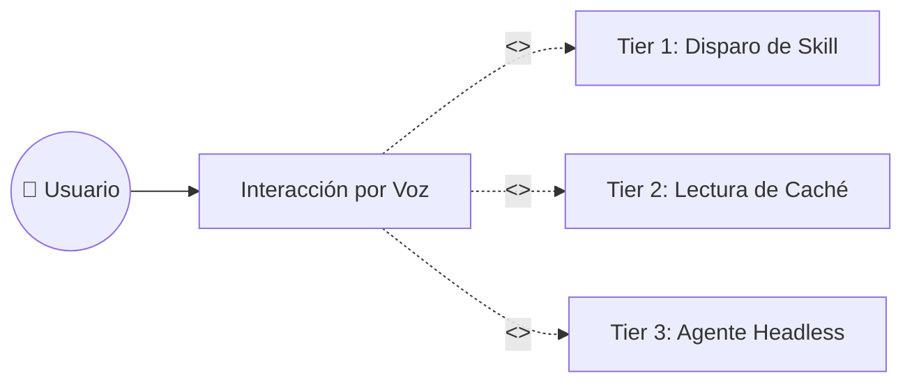

# Caso de Uso: UC-01 — Interacción por Voz y Enrutamiento Inteligente 3-Tier

> **ID:** `UC-01` | **Requisito Asociado:** `RF-01`  
> **Dominio:** Voz / Inteligencia Artificial  
> **Autor:** Jhonny Lorenzo (`jlorenzor`)  
> **Estándar Horario:** `PET / UTC-5 - Hora Perú`

---

## 📋 Ficha de Especificación

| Campo | Detalle |
| :--- | :--- |
| **Descripción** | Permite interactuar mediante comandos de voz desde cualquier aplicación o desde el dashboard para obtener respuestas inmediatas, ejecutar habilidades o delegar tareas complejas mediante un enrutador inteligente de 3 niveles. |
| **Actores** | Usuario (Jhonny Lorenzo) |
| **Precondición** | Demonio de `whisper-cli` (Whisper Large v3 Turbo) y motor `Kokoro TTS` activos con micrófono del sistema habilitado. |
| **Flujo Principal** | 1. El usuario presiona el hotkey global (`Cmd+Shift+Space` o `Espacio` en el HUD) y pronuncia un comando. 2. El motor Whisper transcribe el audio en hardware local con GPU Metal. 3. El enrutador semántico LLM (`qwen2.5:3b`) clasifica la intención en uno de los 3 niveles (*Tier 1: Skill, Tier 2: Caché, Tier 3: Headless Agent*). 4. Si es Tier 2, el sistema consulta el snapshot JSON en el Vault (<20ms). 5. El sistema sintetiza la respuesta con Kokoro TTS y reproduce el audio al usuario. 6. El sistema muestra la transcripción y el estado en el HUD. |
| **Subflujos** | - **Subflujo A (Tier 1):** Si el comando es una habilidad registrada, el sistema ejecuta la skill directamente y confirma la acción. - **Subflujo B (Tier 3):** Si la solicitud es compleja, lanza un subagente CLI en segundo plano y notifica por voz. |
| **Flujos Alternativos** | - **Audio inaudible:** Muestra mensaje de silencio y cierra la sesión de escucha. - **Fallo de conectividad en Router:** Recurre a motor local de fallback. |
| **Postcondición** | La consulta es respondida de forma auditiva y visual, registrándose en el ledger de auditoría. |

---

## 🔄 Mini-Diagrama de Flujo

---
[⬅️ Volver a la Tabla de Contenidos de Casos de Uso](./index.md)
