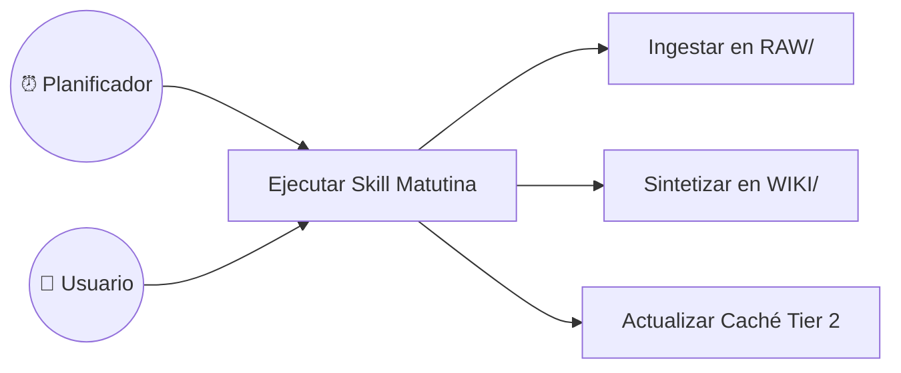

# Caso de Uso: UC-02 — Ejecución de Skills y Automatizaciones Programadas

> **ID:** `UC-02` | **Requisito Asociado:** `RF-02`  
> **Dominio:** Operaciones y Automatización  
> **Autor:** Jhonny Lorenzo (`jlorenzor`)  
> **Estándar Horario:** `PET / UTC-5 - Hora Perú`

---

## 📋 Ficha de Especificación

| Campo | Detalle |
| :--- | :--- |
| **Descripción** | Describe la ejecución manual o desatendida (*cron*) de procedimientos deterministas codificados para extraer inteligencia, sincronizar calendarios o actualizar índices. |
| **Actores** | Usuario, Planificador Cron (`node-cron` / `launchd`) |
| **Precondición** | Las habilidades deben estar registradas en `SkillRegistry` con sus respectivos parámetros y scripts. |
| **Flujo Principal** | 1. El usuario hace clic en el botón de la skill en el Command Deck (o el planificador cron alcanza la hora fijada, ej. 08:00 AM). 2. El sistema valida los parámetros de entrada y dispara el script de la skill. 3. La skill recopila información de fuentes externas (GitHub Trending, Hacker News, Obsidian). 4. La skill almacena los datos brutos en `RAW/` y sintetiza los reportes en `WIKI/` y `OUTPUT/`. 5. El indexador actualiza la tabla de contenidos en `index.md`. 6. El dashboard actualiza los widgets visuales y la caché de Tier 2 queda lista. |
| **Flujos Alternativos** | - **Error en API externa:** Si una fuente no responde, la skill utiliza el último snapshot válido en caché y emite advertencia en el log. |
| **Postcondición** | Los reportes están disponibles en el Vault de Obsidian y los widgets del dashboard reflejan los nuevos datos. |

---

## 🔄 Mini-Diagrama de Flujo

---
[⬅️ Volver a la Tabla de Contenidos de Casos de Uso](./index.md)
