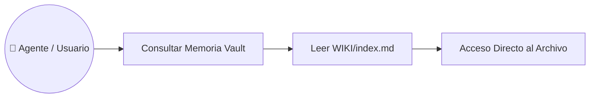

# Caso de Uso: UC-03 — Navegación y Consulta de Memoria en Vault (Patrón Karpathy)

> **ID:** `UC-03` | **Requisito Asociado:** `RF-03`  
> **Dominio:** Memoria / Almacenamiento  
> **Autor:** Jhonny Lorenzo (`jlorenzor`)  
> **Estándar Horario:** `PET / UTC-5 - Hora Perú`

---

## 📋 Ficha de Especificación

| Campo | Detalle |
| :--- | :--- |
| **Descripción** | Describe cómo un usuario o un agente autónomo navega por la jerarquía de notas del Vault utilizando el mapa maestro `AGENTS.md` e índices jerárquicos `index.md` para recuperar información sin consumir tokens excesivos. |
| **Actores** | Usuario, Agente CLI / Agente MCP |
| **Precondición** | El Vault debe seguir la estructura `RAW/`, `WIKI/`, `OUTPUT/` con sus respectivos archivos `index.md`. |
| **Flujo Principal** | 1. El actor solicita buscar un dato o concepto específico. 2. El sistema lee el índice temático de nivel superior en `WIKI/index.md`. 3. El sistema identifica la subcarpeta pertinente y desciende al archivo específico requerido. 4. Se extrae la respuesta y se presenta al actor. 5. Si la información no existe, se consulta el registro en `RAW/` para determinar si requiere síntesis. |
| **Flujos Alternativos** | - **Índice desactualizado:** Si se detectan archivos huérfanos sin indexar, se dispara automáticamente la skill `vault-sync-indexer`. |
| **Postcondición** | La consulta se resuelve con un consumo mínimo de tokens (< 500 tokens vs > 50,000 en escaneo ciego). |

---

## 🔄 Mini-Diagrama de Flujo

---
[⬅️ Volver a la Tabla de Contenidos de Casos de Uso](./index.md)
