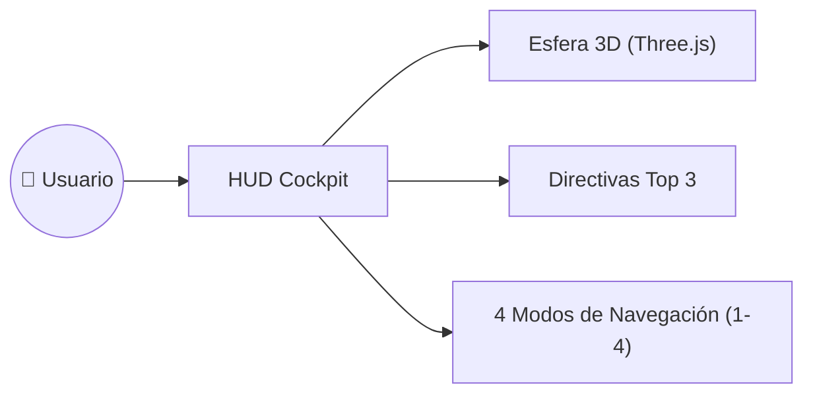

# Caso de Uso: UC-04 — Control Visual, Cockpit y Gestión de Directivas Diarias

> **ID:** `UC-04` | **Requisito Asociado:** `RF-04`  
> **Dominio:** Frontend / Interfaz de Usuario  
> **Autor:** Jhonny Lorenzo (`jlorenzor`)  
> **Estándar Horario:** `PET / UTC-5 - Hora Perú`

---

## 📋 Ficha de Especificación

| Campo | Detalle |
| :--- | :--- |
| **Descripción** | Permite al usuario supervisar en tiempo real los signos vitales del sistema, interactuar con la Esfera Neuronal 3D, gestionar su checklist de directivas diarias prioritarias y conmutar entre los 4 modos del HUD. |
| **Actores** | Usuario (Jhonny Lorenzo) |
| **Precondición** | Servidor web frontend activo en `http://localhost:3000`. |
| **Flujo Principal** | 1. El usuario abre el Cockpit en su navegador o app de escritorio. 2. Se renderiza la Esfera 3D con Three.js respondiendo a la modulación de audio. 3. El usuario marca o desmarca tareas en el checklist de Directivas Top 3 (persistido en LocalStorage). 4. El usuario conmuta entre los 4 modos con teclas `1`, `2`, `3`, `4`. 5. El usuario puede alternar tema claro (`L`), alto contraste (`H`) o abrir la terminal shell (`T`). |
| **Postcondición** | Las preferencias de vista y estado de directivas se mantienen sincronizados sin latencia. |

---

## 🔄 Mini-Diagrama de Flujo

---
[⬅️ Volver a la Tabla de Contenidos de Casos de Uso](./index.md)
