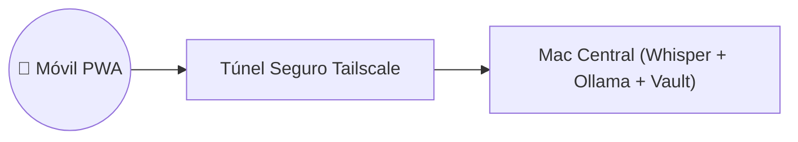

# Caso de Uso: UC-05 — Acceso Remoto Móvil Seguro (Tailscale / Cloudflare)

> **ID:** `UC-05` | **Requisito Asociado:** `RF-05`  
> **Dominio:** Redes e Infraestructura Móvil  
> **Autor:** Jhonny Lorenzo (`jlorenzor`)  
> **Estándar Horario:** `PET / UTC-5 - Hora Perú`

---

## 📋 Ficha de Especificación

| Campo | Detalle |
| :--- | :--- |
| **Descripción** | Permite acceder a la Progressive Web App (PWA) de TrautsLab OS desde un smartphone fuera del hogar sin abrir puertos públicos vulnerables ni incurrir en costes de servidores cloud. |
| **Actores** | Usuario en Movilidad (iPhone / Android) |
| **Precondición** | Túnel Tailscale o Cloudflare Zero Trust activo en la máquina principal (Mac). |
| **Flujo Principal** | 1. El usuario abre la PWA en su teléfono conectada a la VPN privada de Tailscale. 2. Se autentica de forma transparente mediante cifrado punto a punto WireGuard. 3. El usuario puede ver su agenda, directivas y pulsar el Voice Orb móvil para dictar notas de voz. 4. El audio viaja cifrado al Mac local donde corre Whisper Metal y el Enrutador LLM. |
| **Flujos Alternativos** | - **Pérdida de conectividad móvil:** El usuario recurre a notas de voz asíncronas en el bot de Telegram (`@TrautsLabBot`). |
| **Postcondición** | Acceso seguro garantizado con costo mensual $0. |

---

## 🔄 Mini-Diagrama de Flujo

---
[⬅️ Volver a la Tabla de Contenidos de Casos de Uso](./index.md)
