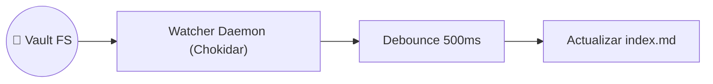

# Caso de Uso: UC-06 — Observador en Tiempo Real e Indexación Incremental del Vault

> **ID:** `UC-06` | **Requisito Asociado:** `RF-06`  
> **Dominio:** Memoria / Sistema de Archivos  
> **Autor:** Jhonny Lorenzo (`jlorenzor`)  
> **Estándar Horario:** `PET / UTC-5 - Hora Perú`

---

## 📋 Ficha de Especificación

| Campo | Detalle |
| :--- | :--- |
| **Descripción** | Mantiene un demonio residente en memoria que vigila los cambios en el Obsidian Vault y ejecuta una reindexación automática con ventana de debounce (500ms). |
| **Actores** | Observador de Archivos Chokidar (`vault-watcher`) |
| **Precondición** | Permisos de lectura/escritura en el directorio del Vault. |
| **Flujo Principal** | 1. El demonio inicia su escucha recursiva en `RAW/`, `WIKI/` y `OUTPUT/`. 2. Al detectarse un evento `add`, `change` o `unlink`, se inicia el temporizador de debounce. 3. Transcurridos 500ms sin nuevos eventos, se dispara la indexación incremental. 4. Se reescriben únicamente los `index.md` afectados. 5. Se emite notificación de estado en el log de eventos y se actualiza la caché Tier 2. |
| **Flujos Alternativos** | - **Archivos ignorados:** Descarta automáticamente `.DS_Store`, `.obsidian/workspace.json` o carpetas temporales. |
| **Postcondición** | El Vault refleja los cambios en sus tablas de contenidos en menos de 1 segundo tras la modificación. |

---

## 🔄 Mini-Diagrama de Flujo

---
[⬅️ Volver a la Tabla de Contenidos de Casos de Uso](./index.md)
