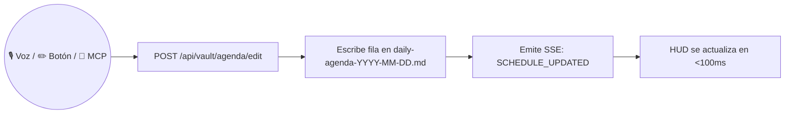

# Caso de Uso: UC-07 — Edición In-Place y Modificación de Agenda en Markdown

> **ID:** `UC-07` | **Requisito Asociado:** `RF-07`  
> **Dominio:** Productividad y Gestión del Tiempo  
> **Autor:** Jhonny Lorenzo (`jlorenzor`)  
> **Estándar Horario:** `PET / UTC-5 - Hora Perú`

---

## 📋 Ficha de Especificación

| Campo | Detalle |
| :--- | :--- |
| **Descripción** | Permite modificar el título, la hora, la ubicación o el estado de un evento existente en el archivo `daily-agenda-[fecha].md` mediante interfaz visual, llamada a la API HTTP o comando de voz en lenguaje natural. |
| **Actores** | Usuario (Voz / Web HUD / Telegram / MCP) |
| **Precondición** | Existencia del archivo `daily-agenda-[fecha].md` en el Vault. |
| **Flujo Principal** | 1. El usuario pulsa el botón de edición `✏️` en el HUD (o dicta *"Cambia el evento de las 9:30 por Ver Spiderman en Centro Cívico"*). 2. El sistema localiza la fila correspondiente en la tabla Markdown mediante concordancia semántica o índice de fila. 3. El sistema reescribe la fila preservando el formato de tabla y frontmatter YAML. 4. Se actualiza el snapshot JSON en `today-agenda.json`. 5. Se emite el evento SSE `SCHEDULE_UPDATED` para refrescar todas las vistas en < 100ms. |
| **Flujos Alternativos** | - **Evento inexistente:** Ofrece crearlo como nuevo compromiso. |
| **Postcondición** | La agenda en Markdown y la caché reflejan la versión corregida de inmediato. |

---

## 🔄 Mini-Diagrama de Flujo

---
[⬅️ Volver a la Tabla de Contenidos de Casos de Uso](./index.md)
