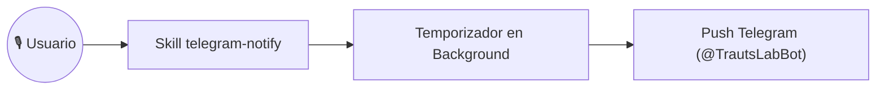

# Caso de Uso: UC-08 — Notificaciones Push y Temporizadores Diferidos en Telegram

> **ID:** `UC-08` | **Requisito Asociado:** `RF-08`  
> **Dominio:** Mensajería y Operaciones  
> **Autor:** Jhonny Lorenzo (`jlorenzor`)  
> **Estándar Horario:** `PET / UTC-5 - Hora Perú`

---

## 📋 Ficha de Especificación

| Campo | Detalle |
| :--- | :--- |
| **Descripción** | Permite el envío inmediato de notificaciones push o la programación de recordatorios diferidos (ej: *"notifícame en 2 minutos para votar la basura"*) directamente al Telegram de Jhonny Lorenzo (@TrautsLabBot). |
| **Actores** | Usuario, Skill `telegram-notify` |
| **Precondición** | Demonio de Telegram activo y token configurado en `.env`. |
| **Flujo Principal** | 1. El usuario solicita una notificación o recordatorio por voz o texto. 2. El enrutador LLM clasifica la intención en la skill `telegram-notify` y extrae el mensaje y el tiempo de retraso (`delaySeconds`/`delayMinutes`). 3. Si tiene temporizador diferido, se inicia un `setTimeout` en segundo plano y se responde inmediatamente por voz confirmando la programación. 4. Al cumplirse el tiempo, el sistema envía el mensaje push con formato Markdown a Telegram (`@TrautsLabBot`). |
| **Flujos Alternativos** | - **Fallo en API de Telegram:** Reintenta con backoff exponencial y emite log de error. |
| **Postcondición** | El usuario recibe la alerta sonora y visual en su dispositivo móvil. |

---

## 🔄 Mini-Diagrama de Flujo

---
[⬅️ Volver a la Tabla de Contenidos de Casos de Uso](./index.md)
