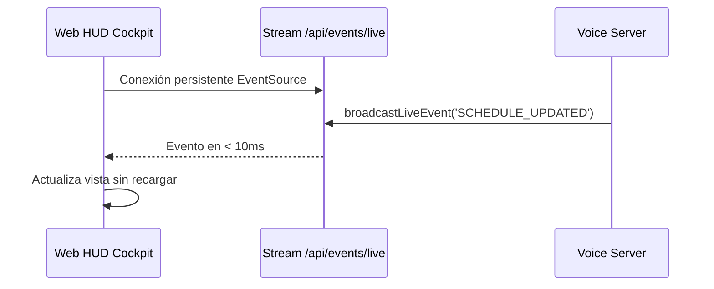

# Caso de Uso: UC-09 — Canal Reactivo Server-Sent Events (SSE) y Auto-Sincronización

> **ID:** `UC-09` | **Requisito Asociado:** `RF-09`  
> **Dominio:** Tiempo Real / Arquitectura Web  
> **Autor:** Jhonny Lorenzo (`jlorenzor`)  
> **Estándar Horario:** `PET / UTC-5 - Hora Perú`

---

## 📋 Ficha de Especificación

| Campo | Detalle |
| :--- | :--- |
| **Descripción** | Mantiene una conexión HTTP persistente mediante Server-Sent Events para notificar al Frontend y clientes conectados sobre cambios en la agenda, ejecución de skills o actualizaciones en el Vault sin recargas de página. |
| **Actores** | Web HUD, Servidor de Voz (`VoiceServer`) |
| **Precondición** | Servidor de voz activo en el puerto 3030 con endpoint `/api/events/live`. |
| **Flujo Principal** | 1. El frontend inicializa un objeto `EventSource('/api/events/live')`. 2. El servidor registra al cliente en la lista de conexiones activas. 3. Al ocurrir una mutación (`SCHEDULE_UPDATED`, `TASK_ARCHIVED`, `INTEL_UPDATED`), el servidor transmite el evento en formato `data: JSON`. 4. El frontend recibe el evento y actualiza selectivamente los componentes visuales afectados sin parpadeos ni recargas. |
| **Flujos Alternativos** | - **Desconexión:** El cliente activa sincronización secundaria pasiva (cada 2.5s) y auto-reconecta automáticamente. |
| **Postcondición** | El HUD refleja el estado del sistema en tiempo real con latencia inferior a 100ms. |

---

## 🔄 Mini-Diagrama de Flujo

---
[⬅️ Volver a la Tabla de Contenidos de Casos de Uso](./index.md)
