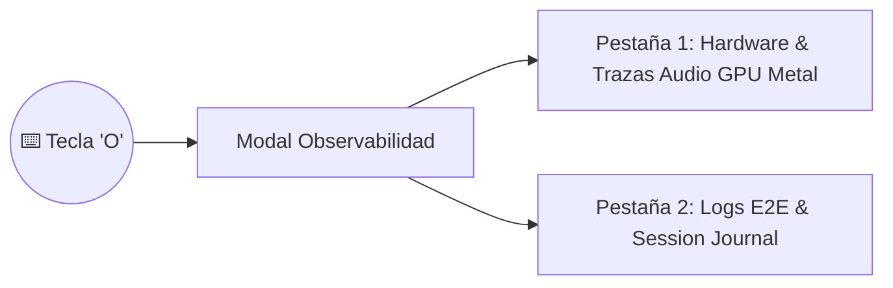

# Caso de Uso: UC-10 — Hub de Observabilidad E2E y Registro de Sesiones

> **ID:** `UC-10` | **Requisito Asociado:** `RF-10`  
> **Dominio:** Telemetría y Operaciones  
> **Autor:** Jhonny Lorenzo (`jlorenzor`)  
> **Estándar Horario:** `PET / UTC-5 - Hora Perú`

---

## 📋 Ficha de Especificación

| Campo | Detalle |
| :--- | :--- |
| **Descripción** | Ofrece un panel de control accesible mediante la tecla `O` que expone métricas de hardware (GPU Metal, RAM, modelos activos), trazas de audio de 5 etapas con latencias milimétricas y un registro consolidado de interacciones que se persiste en el Vault. |
| **Actores** | Usuario (Jhonny Lorenzo) |
| **Precondición** | Módulos de telemetría y gestor de sesiones inicializados en el servidor de voz. |
| **Flujo Principal** | 1. El usuario presiona la tecla `O` en el dashboard. 2. El sistema abre el modal de observabilidad de 2 pestañas (*Telemetría de Audio/Hardware* y *Logs & Sesión E2E*). 3. Se consultan los endpoints de telemetría y se renderizan las etapas de procesamiento con sus latencias exactas. 4. Al finalizar el día, el gestor de sesiones exporta el diario consolidado a `OUTPUT/reports/session-journal-[fecha].md`. |
| **Flujos Alternativos** | - **Fallo de componente:** La tarjeta correspondiente se colorea en rojo con el motivo exacto del error. |
| **Postcondición** | Diagnóstico completo accesible en cualquier momento para auditoría y optimización de latencias. |

---

## 🔄 Mini-Diagrama de Flujo

---
[⬅️ Volver a la Tabla de Contenidos de Casos de Uso](./index.md)
