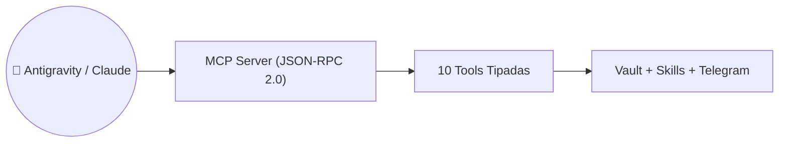

# Caso de Uso: UC-11 — Servidor Model Context Protocol (MCP) e Interoperabilidad

> **ID:** `UC-11` | **Requisito Asociado:** `RF-11`  
> **Dominio:** Interoperabilidad con Agentes de IA  
> **Autor:** Jhonny Lorenzo (`jlorenzor`)  
> **Estándar Horario:** `PET / UTC-5 - Hora Perú`

---

## 📋 Ficha de Especificación

| Campo | Detalle |
| :--- | :--- |
| **Descripción** | Permite a clientes externos de IA (Antigravity, Claude Code, Cursor, Cline) descubrir y ejecutar las 10 herramientas estándar del sistema sobre canales `stdio` y `SSE`. |
| **Actores** | Agente LLM Externo / Antigravity / Claude Code |
| **Precondición** | Servidor MCP configurado en el archivo de configuración del cliente LLM (`mcp_config.json`). |
| **Flujo Principal** | 1. El cliente LLM inicia el proceso `npx tsx packages/mcp-server/src/cli.ts`. 2. El servidor responde al handshake `initialize` con el listado de capacidades. 3. El cliente invoca `tools/list` para descubrir los esquemas y descripciones de las 10 herramientas. 4. El cliente ejecuta `tools/call` con los parámetros validados. 5. El servidor ejecuta la habilidad correspondiente y retorna el resultado en Markdown estructurado. |
| **Flujos Alternativos** | - **Esquema inválido:** Si los argumentos no cumplen el esquema JSON, se retorna un error estándar `-32602`. |
| **Postcondición** | El agente de IA manipula el Obsidian Vault y el calendario sin salir de su entorno de desarrollo. |

---

## 🔄 Mini-Diagrama de Flujo

---
[⬅️ Volver a la Tabla de Contenidos de Casos de Uso](./index.md)
