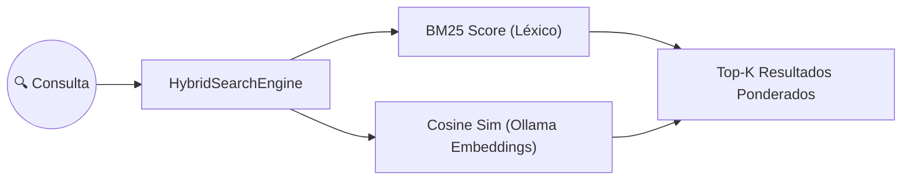

# Caso de Uso: UC-12 — Motor de Búsqueda Vectorial Híbrida (BM25 + Embeddings)

> **ID:** `UC-12` | **Requisito Asociado:** `RF-12`  
> **Dominio:** Búsqueda / Inteligencia Artificial  
> **Autor:** Jhonny Lorenzo (`jlorenzor`)  
> **Estándar Horario:** `PET / UTC-5 - Hora Perú`

---

## 📋 Ficha de Especificación

| Campo | Detalle |
| :--- | :--- |
| **Descripción** | Permite buscar notas y conceptos en el Vault combinando concordancia léxica (BM25) con similitud coseno de embeddings vectoriales generados localmente. |
| **Actores** | Usuario, Agente MCP, Skill `vault-semantic-search` |
| **Precondición** | Notas estructuradas en el Obsidian Vault y servidor Ollama activo. |
| **Flujo Principal** | 1. El usuario o agente envía una consulta semántica (ej: *"modelos de voz con aceleración en GPU"*). 2. El motor genera el vector embedding de la consulta mediante Ollama. 3. Se calcula el score BM25 léxico y la similitud coseno contra cada documento del Vault. 4. Se combinan los puntajes con ponderación $\alpha = 0.5$. 5. Se retorna el Top-K de notas más relevantes con extractos limpios y porcentajes de coincidencia. |
| **Flujos Alternativos** | - **Ollama no disponible:** Recurre a BM25 puro como fallback transparente. |
| **Postcondición** | El usuario encuentra notas conceptuales aunque no recuerde las palabras exactas del título. |

---

## 🔄 Mini-Diagrama de Flujo

---
[⬅️ Volver a la Tabla de Contenidos de Casos de Uso](./index.md)
