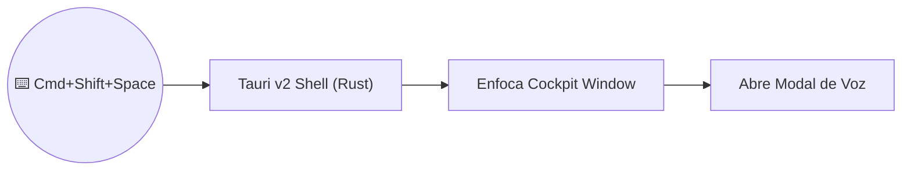

# Caso de Uso: UC-13 — Aplicación Nativa de Escritorio con Tauri v2 y System Tray

> **ID:** `UC-13` | **Requisito Asociado:** `RF-13`  
> **Dominio:** Desktop / macOS Shell  
> **Autor:** Jhonny Lorenzo (`jlorenzor`)  
> **Estándar Horario:** `PET / UTC-5 - Hora Perú`

---

## 📋 Ficha de Especificación

| Campo | Detalle |
| :--- | :--- |
| **Descripción** | Proporciona un ejecutable nativo de escritorio para macOS con icono en la barra de menús (System Tray), control de ventana y atajo de teclado global a nivel de sistema (`Cmd+Shift+Space`). |
| **Actores** | Usuario (Jhonny Lorenzo) |
| **Precondición** | Frontend compilado en `frontend/` y backend de voz corriendo localmente. |
| **Flujo Principal** | 1. El usuario pulsa `Cmd+Shift+Space` desde cualquier aplicación. 2. El backend de Rust en Tauri captura el atajo global y enfoca la ventana del Cockpit. 3. Se invoca automáticamente el modal de captura de voz. 4. El usuario dicta su comando y la interfaz responde en tiempo real. 5. Al hacer clic fuera o pulsar `Esc`, la ventana puede ocultarse al System Tray sin cerrarse. |
| **Flujos Alternativos** | - **Conflicto de hotkey:** Se puede reconfigurar el atajo en `tauri.conf.json`. |
| **Postcondición** | Interacción fluida desde cualquier punto del sistema operativo con huella de memoria < 15MB. |

---

## 🔄 Mini-Diagrama de Flujo

---
[⬅️ Volver a la Tabla de Contenidos de Casos de Uso](./index.md)
