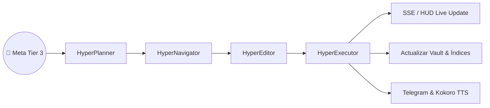

# Caso de Uso: UC-14 — Delegación de Tareas Complejas a Cuadrilla HyperAgent (Tier 3)

> **ID:** `UC-14` | **Requisito Asociado:** `RF-14`  
> **Dominio:** Inteligencia Artificial / Agentes Autónomos  
> **Autor:** Jhonny Lorenzo (`jlorenzor`)  
> **Estándar Horario:** `PET / UTC-5 - Hora Perú`

---

## 📋 Ficha de Especificación

| Campo | Detalle |
| :--- | :--- |
| **Descripción** | Permite al usuario o a un cliente externo (MCP / Telegram / Web HUD) delegar una tarea compleja no determinista a la cuadrilla de 4 roles de HyperAgent (*Planner, Navigator, Editor, Executor*), recibiendo actualizaciones en tiempo real y reporte final estructurado. |
| **Actores** | Usuario (Jhonny Lorenzo), Agente MCP, Enrutador Semántico de Voz |
| **Precondición** | Servidor Ollama activo con modelo local y Obsidian Vault disponible. |
| **Flujo Principal** | 1. El usuario solicita una tarea compleja (ej: *"Investiga modelos de síntesis fonética local y escribe un reporte en WIKI"*). 2. El enrutador clasifica la intención como `TIER_3_AGENT` y responde de inmediato por voz notificando el inicio en segundo plano. 3. `HyperPlanner` descompone la meta en un plan estructurado de tareas. 4. `HyperNavigator` busca antecedentes y referencias en el Vault mediante `HybridSearchEngine`. 5. `HyperEditor` redacta el informe estructurado con Frontmatter YAML en `WIKI/ai-systems/`. 6. `HyperExecutor` valida la sintaxis, dispara `vault-sync-indexer` para actualizar los índices maestros y emite eventos SSE en el HUD. 7. Al completar todos los pasos, se envía notificación push con el resumen a Telegram (`@TrautsLabBot`) y se sintetiza confirmación por voz con Kokoro TTS. |
| **Flujos Alternativos** | - **Fallo en ejecución/sintaxis:** El `HyperExecutor` captura el error y solicita a `HyperEditor` que aplique una corrección (*Auto-Repair Loop*, hasta 3 intentos). |
| **Postcondición** | La meta se cumple de forma desatendida, el conocimiento queda consolidado en el Vault y los índices se mantienen al día. |

---

## 🔄 Mini-Diagrama de Flujo

---
[⬅️ Volver a la Tabla de Contenidos de Casos de Uso](./index.md)
