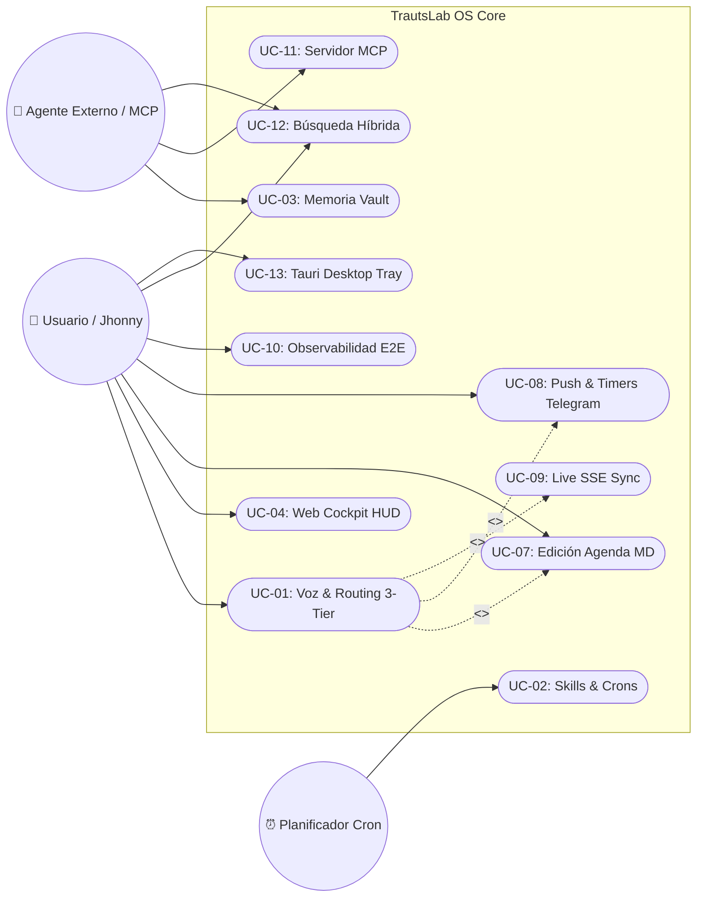

# Tabla de Contenidos Maestra: Especificación de Casos de Uso y Requisitos Funcionales

> **Directorio:** `docs/requirements/use-cases/`  
> **Proyecto:** TrautsLab OS  
> **Versión:** 1.2.0  
> **Autor:** Jhonny Lorenzo (`jlorenzor`)  
> **Estándar Horario:** `PET / UTC-5 - Hora Perú`

---

## 🧭 Mapa de Casos de Uso del Sistema

A continuación se presenta la matriz completa de casos de uso y requisitos funcionales, organizados por dominio operativo con enlaces directos a sus especificaciones aisladas:

| ID | Título del Caso de Uso | Requisito Funcional | Dominio | Ficha Técnica |
| :---: | :--- | :--- | :---: | :---: |
| **UC-01** | Interacción por Voz & Enrutamiento 3-Tier | RF-01 | Voz / AI | [Ver Especificación](./UC-01-voice-interaction-and-3tier-routing.md) |
| **UC-02** | Ejecución de Skills & Automatizaciones Cron | RF-02 | Operaciones | [Ver Especificación](./UC-02-skills-execution-and-cron-automations.md) |
| **UC-03** | Navegación y Consulta de Memoria en Vault | RF-03 | Memoria / Vault | [Ver Especificación](./UC-03-vault-memory-navigation-and-search.md) |
| **UC-04** | Control Visual, Cockpit & Directivas Diarias | RF-04 | Frontend / HUD | [Ver Especificación](./UC-04-visual-dashboard-and-cockpit-control.md) |
| **UC-05** | Acceso Remoto Móvil Seguro (Tailscale/Tunnel) | RF-05 | Infraestructura | [Ver Especificación](./UC-05-mobile-remote-access-and-tunneling.md) |
| **UC-06** | Observador en Tiempo Real e Indexación Incremental | RF-06 | Memoria / Vault | [Ver Especificación](./UC-06-realtime-vault-watcher-and-indexing.md) |
| **UC-07** | Edición In-Place y Modificación de Agenda en Markdown | RF-07 | Productividad | [Ver Especificación](./UC-07-live-calendar-editing-and-archiving.md) |
| **UC-08** | Notificaciones Push & Temporizadores en Telegram | RF-08 | Mensajería / Ops | [Ver Especificación](./UC-08-telegram-push-notifications-and-timers.md) |
| **UC-09** | Canal Reactivo Server-Sent Events (SSE) | RF-09 | Tiempo Real | [Ver Especificación](./UC-09-realtime-server-sent-events-sync.md) |
| **UC-10** | Hub de Observabilidad E2E y Trazas Acústicas | RF-10 | Telemetría / Ops | [Ver Especificación](./UC-10-e2e-observability-and-session-ledger.md) |
| **UC-11** | Servidor Model Context Protocol (MCP) para Agentes | RF-11 | Interoperabilidad | [Ver Especificación](./UC-11-mcp-server-and-agent-interoperability.md) |
| **UC-12** | Motor de Búsqueda Vectorial Híbrida (BM25+Embeddings) | RF-12 | Búsqueda / AI | [Ver Especificación](./UC-12-hybrid-semantic-vector-search.md) |
| **UC-13** | Aplicación Nativa de Escritorio con Tauri v2 & Tray | RF-13 | Desktop / macOS | [Ver Especificación](./UC-13-tauri-desktop-app-and-system-tray.md) |
| **UC-14** | Delegación de Tareas Complejas a Cuadrilla HyperAgent | RF-14 | Agentes / Tier 3 | [Ver Especificación](./UC-14-hyperagent-tier3-multi-role-delegation.md) |

---

## 📊 Diagrama General de Relaciones de Casos de Uso

