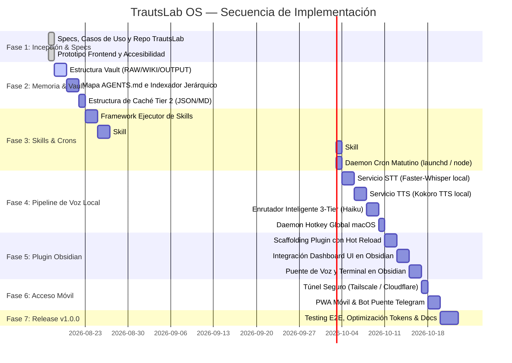

# TrautsLab OS — Roadmap de Implementación Secuencial

> **Documento:** `docs/roadmap/implementation-roadmap.md`  
> **Proyecto:** TrautsLab OS  
> **Estado:** Aprobado para Ejecución  
> **Fecha:** 2026-08-17  

Este documento establece la **secuencia cronológica de ingeniería y desarrollo** para construir TrautsLab OS de forma modular, incremental y verificable, avanzando desde los cimientos de memoria y automatización hasta la capa de voz en tiempo real y el plugin para Obsidian.

---

## 🗺️ Diagrama de Fases del Roadmap

---

## 🎯 Secuencia Detallada por Fases

---

### 🟢 FASE 1: Incepción, Diseño y Especificaciones (*COMPLETADA — v0.1.0-alpha.1*)
- [x] Documento fundacional de visión (`0-main-idea.md`).
- [x] Análisis de arquitectura móvil fuera de casa y costes (`1-mobile-remote-access-and-costs.md`).
- [x] Prototipo frontend interactivo con roles ARIA, atajos de teclado y simulación 3-Tier (`frontend/`).
- [x] Especificación formal de Casos de Uso y Requisitos Funcionales (`use-cases.md`).
- [x] Diagramas de arquitectura, componentes, secuencia y actividades (`diagrams.md`).
- [x] Repositorio en GitHub bajo la organización `trautslab/TrautsLab-OS` con SemVer, Changelog y Contributing.

---

### 🔵 FASE 2: Cimientos de Memoria y Navegación en el Vault (*COMPLETADA — v0.1.0-alpha.2*)
**Objetivo:** Crear el sistema de archivos que actuará como base de datos y memoria contextual de TrautsLab OS.

- [x] **Paso 2.1 — Estructura Física del Vault:** Creación de directorios estándar (`vault/RAW/`, `vault/WIKI/`, `vault/OUTPUT/cache/`) y notas iniciales con frontmatter.
- [x] **Paso 2.2 — Script de Indexación Jerárquica (`vault-indexer`):** Motor de indexado recursivo (`@trautslab/vault-engine`) que genera tablas de contenidos maestras y sub-índices por dominio temático.
- [x] **Paso 2.3 — Demonio Observador de Archivos (`vault-watcher`):** Observador en tiempo real con debounce de 500ms para reindexación incremental desatendida.
- [x] **Paso 2.4 — Esquema de Caché para Tier 2 y Lector Rápido:** Formato snapshot JSON (`today-intel.json`, `today-agenda.json`) y lector de resúmenes fonéticos para Kokoro TTS (<10ms).
- [x] **Paso 2.5 — Auditor de Salud (`vault-health`):** Verificador de integridad de notas y conformidad de YAML frontmatter.

---

### 🟣 FASE 3: Motor de Habilidades (Skills) y Automatizaciones
**Objetivo:** Desarrollar las primeras rutinas deterministas que alimentan de información al sistema cada mañana.

1. **Paso 3.1 — Framework Ejecutor de Skills:**
   - Crear una interfaz estándar para registrar, ejecutar y loguear habilidades.
2. **Paso 3.2 — Implementación de Habilidades Core:**
   - **`morning-intel-scan`:** Scraper/Fetcher que consulta GitHub Trending (7d/30d) y Hacker News Top Stories, almacena los datos brutos en `RAW/` y genera el reporte sintetizado en `WIKI/` y `OUTPUT/`.
   - **`calendar-daily-brief`:** Conector con Google Calendar / iCal que extrae los eventos del día y los formatea con sus prioridades.
3. **Paso 3.3 — Planificador de Automatizaciones (Cron Daemon):**
   - Configurar servicio desatendido (mediante daemon local `launchd` en macOS o `node-cron`) para ejecutar `morning-intel-scan` automáticamente a las 08:00 AM todos los días.

---

### 🟠 FASE 4: Pipeline de Voz Local e Híbrido (3-Tier Engine)
**Objetivo:** Permitir la interacción conversacional ultrarrápida mediante hotkey global.

1. **Paso 4.1 — Servicio de Transcripción (STT):**
   - Montar servidor local de `Faster-Whisper` optimizado para GPU/MPS en Mac (o API ultrarrápida de Groq Whisper como fallback).
2. **Paso 4.2 — Servicio de Síntesis de Voz (TTS):**
   - Integrar `Kokoro TTS` (motor ligero de 82M parámetros) generando audio natural en tiempo real con latencia inferior a 300ms.
3. **Paso 4.3 — Cerebro Enrutador (3-Tier Router):**
   - Implementar el enrutador inteligente (Claude 3.5 Haiku / LLM local) que recibe el texto del STT y clasifica:
     - **Tier 1:** Dispara la skill correspondiente y confirma por voz.
     - **Tier 2:** Lee el archivo de caché en `OUTPUT/cache/` y responde de inmediato.
     - **Tier 3:** Dispara el agente CLI en modo *headless* en segundo plano.
4. **Paso 4.4 — Hotkey Global de Sistema:**
   - Crear daemon de escucha para macOS (atajo global configurable, ej. `Cmd+Shift+Espacio`) para activar el asistente de voz incluso fuera de Obsidian.

---

### 🟡 FASE 5: Plugin de Obsidian (Centro de Mando Visual)
**Objetivo:** Integrar el dashboard interactivo dentro de Obsidian como plugin nativo.

1. **Paso 5.1 — Scaffolding del Plugin:**
   - Configurar proyecto de plugin Obsidian en TypeScript con soporte de desarrollo rápido (*Hot Reload*).
2. **Paso 5.2 — Migración del Dashboard UI:**
   - Portar la interfaz creada en `frontend/` (Glassmorphism, modo alto contraste, widgets en tiempo real) a una vista personalizada (*Custom View*) en Obsidian.
3. **Paso 5.3 — Conexión Bidireccional:**
   - Conectar los botones de la UI con el motor de skills, el log de ejecución en tiempo real y el Voice Orb.

---

### 📱 FASE 6: Acceso Remoto Móvil y Asistente en la Calle
**Objetivo:** Permitir el uso de TrautsLab OS desde el teléfono celular fuera de casa.

1. **Paso 6.1 — Configuración del Túnel Seguro:**
   - Despliegue de túnel privado con **Tailscale** o **Cloudflare Zero Trust** para conectar el smartphone con el Mac de casa de forma cifrada y sin abrir puertos.
2. **Paso 6.2 — PWA Móvil & Bot de Telegram/WhatsApp:**
   - Configuración del frontend como PWA instalable en iOS/Android.
   - Creación de un bot privado de Telegram como interfaz de respaldo para notas de voz sobre la marcha.

---

### 🏁 FASE 7: Optimización, Evaluaciones y Release v1.0.0 Estable
**Objetivo:** Asegurar la robustez, determinismo y eficiencia del sistema completo.

1. **Paso 7.1 — Auditoría de Tokens y Latencias:**
   - Medición de reducción de consumo de tokens y verificación de latencias (< 800ms en respuestas de voz Tier 2).
2. **Paso 7.2 — Self-Improving Loops:**
   - Mecanismos de refinamiento continuo de prompts y evaluación de calidad de los reportes generados.
3. **Paso 7.3 — Publicación de Versión Estable:**
   - Actualización de changelog y etiquetado de la versión `v1.0.0`.
