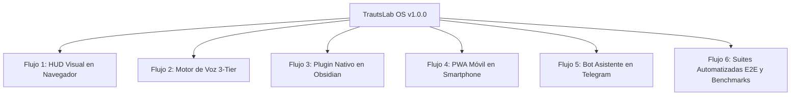

# TrautsLab OS v1.0.0 — Guía Maestra de Flujos de Prueba y Exploración

> **Documento:** `docs/testing/testing-guide.md`  
> **Proyecto:** TrautsLab OS  
> **Versión:** `v1.0.0` (Lanzamiento Oficial Estable)  
> **Fecha y Hora:** 2026-08-17 12:53:00 (PET / UTC-5 - Hora Perú)  
> **Autor:** Jhonny Lorenzo ([@jlorenzor](https://github.com/jlorenzor))  

---

## 🎯 1. Mapa de Flujos de Prueba

Esta guía describe **6 flujos interactivos paso a paso** para probar y experimentar cada uno de los subsistemas de **TrautsLab OS**:



---

## 🖥️ Flujo 1: Exploración del Centro de Mando Cinemático (HUD Visual)

**Objetivo:** Probar la interfaz visual V.A.U.L.T., interactividad 3D, atajos de teclado y persistencia.

### Paso a Paso:
1. **Abrir el HUD en tu navegador:**
   Asegúrate de que el servidor local está activo (puerto 3000) e ingresa a:  
   👉 [http://localhost:3000](http://localhost:3000)
2. **Interactuar con la Esfera Neuronal 3D:**
   - Mueve el cursor sobre la esfera central: observa la física de repulsión y atracción de los 360 nodos Fibonacci.
   - Haz clic en el orbe central o presiona `V` para abrir el modal de voz y ver los ecualizadores de audio.
3. **Probar la Navegación por Pestañas (HUD Mode Switcher):**
   - Presiona la tecla **`1`**: Modo **COCKPIT** (Vitals, Sparklines, Directivas, Command Deck).
   - Presiona la tecla **`2`**: Modo **DAILY INTEL** (Feed de GitHub Trending y Hacker News).
   - Presiona la tecla **`3`**: Modo **VAULT MEMORY** (Explorador jerárquico Karpathy con lector de notas Markdown en tiempo real).
   - Presiona la tecla **`4`**: Modo **SKILLS & CRON** (Catálogo de habilidades y temporizadores).
4. **Probar Atajos de Teclado y Temas:**
   - Presiona **`L`**: Conmuta entre **Amber Void** (Oscuro) y **Pure Light HUD** (Claro).
   - Presiona **`T`**: Abre o cierra el cajón inferior de Terminal Shell (`>_`).
   - Presiona **`Esc`**: Cierra cualquier modal o cajón activo.
5. **Probar las Directivas Top 3 (Persistencia Local):**
   - Marca o desmarca cualquiera de los checkboxes de las directivas en el panel izquierdo.
   - Recarga la página (`Cmd+R`): verifica que tu progreso se mantiene guardado en `localStorage`.

---

## 🎙️ Flujo 2: Pipeline de Voz Local e Híbrido 3-Tier

**Objetivo:** Verificar la respuesta instantánea en menos de 20ms en el Tier 2 y la delegación inteligente a Skills y Agentes.

### Paso a Paso:
Abre una terminal y ejecuta la suite interactiva de simulación de voz:
```bash
cd /Users/jlorenzor/Documents/TrautsLab-OS/packages/voice-engine
npm test
```

### Consultas de Prueba recomendadas:
* **Prueba Tier 2 (Caché Instantánea < 20ms):**
  ```bash
  npm run query "¿Qué es lo más importante en mi agenda hoy?"
  npm run query "¿Cuál es la noticia de IA más destacada de hoy?"
  ```
* **Prueba Tier 1 (Disparo Determinista de Skill):**
  ```bash
  npm run query "Ejecuta el escaneo de inteligencia matutino"
  ```
* **Prueba Tier 3 (Lanzamiento de Agente Headless):**
  ```bash
  npm run query "Investiga las diferencias entre arquitecturas MoE de DeepSeek y Llama 3"
  ```

---

## 📓 Flujo 3: Experiencia Integrada en Obsidian Vault

**Objetivo:** Validar el dashboard dentro de tu Obsidian Vault de trabajo diario.

### Paso a Paso:
1. **Abrir Obsidian:**
   - Abre tu aplicación de **Obsidian**.
   - Abre el vault en `/Users/jlorenzor/Documents/Obsidian Vault` (o presiona `Cmd+R` si ya lo tienes abierto).
2. **Abrir el Command Center:**
   - En la barra lateral izquierda, haz clic en el nuevo icono de rayo ⚡ (**TrautsLab OS**).
   - O presiona `Cmd+P` y busca el comando: `TrautsLab OS: Abrir Command Center Dashboard`.
3. **Probar Auto-Indexación en Tiempo Real (Patrón Karpathy):**
   - En Obsidian, crea una nueva nota en `WIKI/ai-systems/mi-nota-prueba.md` con el siguiente contenido:
     ```markdown
     ---
     title: "Mi Nueva Nota de Prueba"
     domain: "ai-systems"
     summary: "Nota de prueba para verificar el watcher y reindexador automático."
     tags: [test, trautslab]
     ---
     # Contenido de prueba
     ```
   - Abre el archivo `WIKI/index.md`: verás que la nota ha sido incorporada automáticamente a la Tabla de Contenidos Maestra.

---

## 📱 Flujo 4: Acceso Remoto Móvil (PWA en Smartphone)

**Objetivo:** Instalar el dashboard en tu teléfono celular como app nativa con costo $0/mes.

### Paso a Paso:
1. **Iniciar el túnel privado en tu Mac:**
   ```bash
   cd /Users/jlorenzor/Documents/TrautsLab-OS
   ./scripts/start-tailscale-serve.sh
   # O si usas Cloudflare:
   ./scripts/start-cloudflare-tunnel.sh
   ```
2. **Abrir en tu teléfono móvil:**
   - Abre la URL segura entregada en **Safari (iOS)** o **Chrome (Android)**.
3. **Instalar en la Pantalla de Inicio:**
   - **iOS Safari:** Botón *Compartir* -> *"Añadir a pantalla de inicio"*.
   - **Android Chrome:** Menú 3 puntos -> *"Instalar aplicación"*.
4. **Verificar Interacción Móvil:**
   - Abre la app desde tu pantalla de inicio: se abrirá a pantalla completa sin barra de navegación del navegador, con soporte táctil y funcionamiento offline vía Service Worker.

---

## 🤖 Flujo 5: Asistente Privado en Telegram (`@trautslab/telegram-bridge`)

**Objetivo:** Enviar notas de voz o comandos desde la calle para consultar tu agenda y disparar habilidades en tu Mac.

### Paso a Paso:
1. **Ejecutar el simulador de Telegram en terminal:**
   ```bash
   cd /Users/jlorenzor/Documents/TrautsLab-OS/packages/telegram-bridge
   npm run simulate
   ```
2. **Comandos soportados para interactuar:**
   * `/start` o `/help`: Ver menú de comandos.
   * `/intel`: Recibir el resumen de GitHub Trending y Hacker News de hoy.
   * `/agenda`: Consultar eventos y compromisos del día.
   * `/run morning-intel-scan`: Disparar la recolección matutina en tu Mac.
   * `/status`: Verificar estado de los daemons y memoria MPS.
3. **Notas de Voz:**
   - Si configuras tu `TELEGRAM_BOT_TOKEN`, puedes enviar audios de voz directamente al bot; el sistema transcribirá tu mensaje con Whisper local y te responderá con audio sintetizado por Kokoro TTS.

---

## 🧪 Flujo 6: Batería de Pruebas Automatizadas E2E y Benchmarks

**Objetivo:** Ejecutar la verificación completa de calidad de código y rendimiento con un solo comando.

### Paso a Paso:
Ejecuta desde la raíz del proyecto:
```bash
cd /Users/jlorenzor/Documents/TrautsLab-OS

# 1. Medir latencias y ahorro de tokens
npx tsx scripts/benchmark-system.ts

# 2. Ejecutar 11 pruebas visuales de escritorio en Google Chrome real
cd packages/ui-tester && npm test

# 3. Ejecutar 6 pruebas visuales móviles (iPhone 14) en Google Chrome real
npm run test:mobile
```
