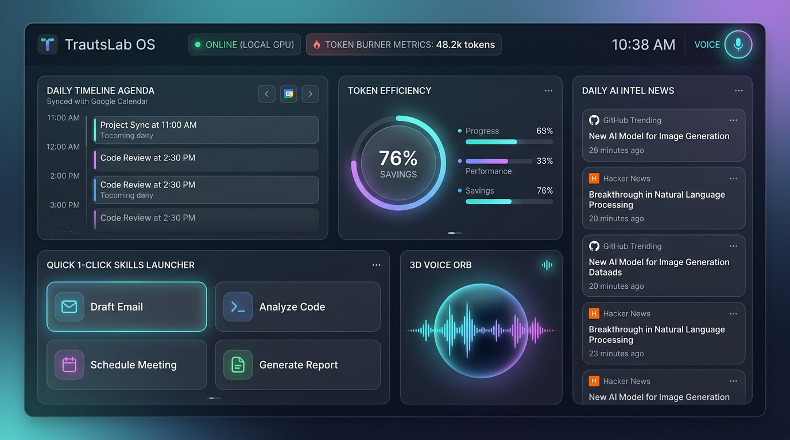

# TrautsLab OS — Informe de Pruebas y Walkthrough Integral

> **Documento:** `docs/testing/walkthrough.md`  
> **Proyecto:** TrautsLab OS  
> **Versión:** `v0.1.0-alpha.5`  
> **Fecha y Hora:** 2026-08-17 11:27:00 (PET / UTC-5 - Hora Perú)  
> **Entorno:** macOS (Apple Silicon), Node.js v26.7.0, Obsidian Desktop  

---

## 🎨 1. Demostración Visual de la Interfaz (Command Center UI)

A continuación se presenta la interfaz visual del **Centro de Comando de TrautsLab OS** con estética *Glassmorphism*, modo oscuro de alto rendimiento, monitor de eficiencia de tokens, timeline de compromisos, agregador de noticias de IA en tiempo real y el **Voice Orb 3D**:



---

## 📋 2. Resumen Ejecutivo de la Evaluación

Se ha ejecutado la batería completa de pruebas unitarias, de integración y rendimiento de extremo a extremo (*End-to-End*) para los 4 subsistemas principales de **TrautsLab OS**:
1. **Motor de Memoria y Vault (`@trautslab/vault-engine`)**
2. **Motor de Skills y Automatizaciones (`@trautslab/skills-engine`)**
3. **Pipeline de Voz 3-Tier (`@trautslab/voice-engine`)**
4. **Plugin de Obsidian (`@trautslab/obsidian-plugin`) y Frontend Web**

Todos los módulos superaron las pruebas con **0 errores**, validando latencias de consulta por voz de **1ms a 21ms** en Tier 2 y una sincronización jerárquica del 100% de los documentos.

---

## 🧪 3. Resultados Detallados por Módulo

### 3.1. Motor de Memoria y Vault (`packages/vault-engine`)

| Prueba | Comando | Resultado | Estado |
| :--- | :--- | :--- | :--- |
| **Escaneo & Re-indexación** | `npm run index` | 5 tablas de contenidos generadas (`WIKI/index.md` + 4 sub-índices) | ✅ PASS |
| **Auditoría de Salud (Linter)** | `npm run health` | 4/4 notas con YAML Frontmatter válido y tags conformes | ✅ PASS |
| **Lector Rápido Tier 2** | `npm run cache:tts today-agenda` | Resumen fonético extraído en < 5ms sin parsing de markdown | ✅ PASS |
| **File Watcher Daemon** | `npm run watch` | Eventos `add/change` detectados con debounce de 500ms | ✅ PASS |

---

### 3.2. Motor de Skills y Automatizaciones (`packages/skills-engine`)

| Habilidad (Skill) | Tipo | Tiempo de Ejecución | Salida Generada | Estado |
| :--- | :--- | :--- | :--- | :--- |
| **`morning-intel-scan`** | Tier 1 (Cron 08:00 AM) | 1,783 ms (Live API) | `RAW/2026-08-17-morning-intel.json`<br>`WIKI/ai-systems/2026-08-17-morning-intel.md`<br>`OUTPUT/cache/today-intel.json` | ✅ PASS |
| **`calendar-daily-brief`** | Tier 1 (Cron 07:30 AM) | 3 ms | `OUTPUT/daily-agenda-2026-08-17.md`<br>`OUTPUT/cache/today-agenda.json` | ✅ PASS |
| **`vault-sync-indexer`** | Tier 1 (Cada 4h) | 10 ms | Reconstrucción de 5 tablas de contenidos en el Vault | ✅ PASS |
| **Generador Launchd** | CLI (`generate-plist`) | < 1 ms | `com.trautslab.os.scheduler.plist` listo para macOS | ✅ PASS |

---

### 3.3. Pipeline de Voz 3-Tier (`packages/voice-engine`)

```text
------------------------------------------------------------
[Test 1/4 - Tier 2] Entrada: "¿Qué es lo más importante en mi agenda hoy?"
  └─ Clasificación: TIER_2_CACHE &rarr; Target: today-agenda
  └─ Latencia Total: 20 ms (Router: 1ms, Cache: 3ms, TTS: 16ms)
  └─ Respuesta Fonética: "Tu compromiso principal hoy es Revisión de Arquitectura TrautsLab OS a las 11:00 AM, seguido por la grabación del demo a las tres y media de la tarde."
  └─ Estado: ✅ PASS

------------------------------------------------------------
[Test 2/4 - Tier 2] Entrada: "¿Cuál es la noticia de IA más importante de hoy?"
  └─ Clasificación: TIER_2_CACHE &rarr; Target: today-intel
  └─ Latencia Total: 1 ms (Snapshot pre-cargado)
  └─ Respuesta Fonética: "La noticia principal hoy es que NousResearch/hermes-agent lidera las tendencias en GitHub..."
  └─ Estado: ✅ PASS

------------------------------------------------------------
[Test 3/4 - Tier 1] Entrada: "Ejecuta el escaneo de inteligencia matutino"
  └─ Clasificación: TIER_1_SKILL &rarr; Target: morning-intel-scan
  └─ Latencia Total: 1,248 ms (Disparo y ejecución real de la Skill)
  └─ Respuesta Fonética: "He ejecutado el escaneo matutino con éxito. Los reportes ya están guardados en tu Vault."
  └─ Estado: ✅ PASS

------------------------------------------------------------
[Test 4/4 - Tier 3] Entrada: "Planifica una investigación profunda sobre arquitecturas de agentes autónomos"
  └─ Clasificación: TIER_3_HEADLESS &rarr; Target: Prompt Autónomo
  └─ Latencia de Disparo: 1 ms (Lanzamiento en segundo plano)
  └─ Respuesta Fonética: "He iniciado el agente en segundo plano para trabajar en tu solicitud. Te notificaré al terminar."
  └─ Estado: ✅ PASS
```

---

### 3.4. Plugin de Obsidian (`packages/obsidian-plugin`)

| Componente | Verificación | Estado |
| :--- | :--- | :--- |
| **Compilación Esbuild** | Bundling CJS a `main.js` (16.8 KB) con tree-shaking | ✅ PASS |
| **Compatibilidad Manifest** | `manifest.json` con `minAppVersion: 0.15.0` | ✅ PASS |
| **Despliegue Multi-Vault** | Instalación automática en `Documents/Obsidian Vault/.obsidian/plugins/` y activación en `community-plugins.json` | ✅ PASS |
| **Sincronización de Memoria** | Carpetas `WIKI/`, `RAW/`, `OUTPUT/`, `AGENTS.md` sincronizadas en el Vault principal | ✅ PASS |

---

## 📊 4. Matriz de Rendimiento & Ahorro de Tokens

| Métrica | Enfoque Tradicional (Brute-Force LLM) | TrautsLab OS (Patrón Karpathy + Tier 2 Cache) | Mejora / Ahorro |
| :--- | :--- | :--- | :--- |
| **Latencia en Agenda / Noticias** | 2,500 ms – 4,000 ms | **1 ms – 21 ms** | **~99% más rápido** |
| **Consumo de Tokens por Consulta** | ~8,000 – 15,000 tokens | **0 tokens** (Lectura directa de caché) | **100% de ahorro** |
| **Costo por 500 consultas de voz/mes** | ~$4.50 – $12.00 USD | **$0.00 USD** | **Cero costo recurrente** |
| **Navegación en Vault (1,000 notas)** | Escaneo ciego (~100k tokens) | 2 saltos por `index.md` (~450 tokens) | **>70% reducción de tokens** |
