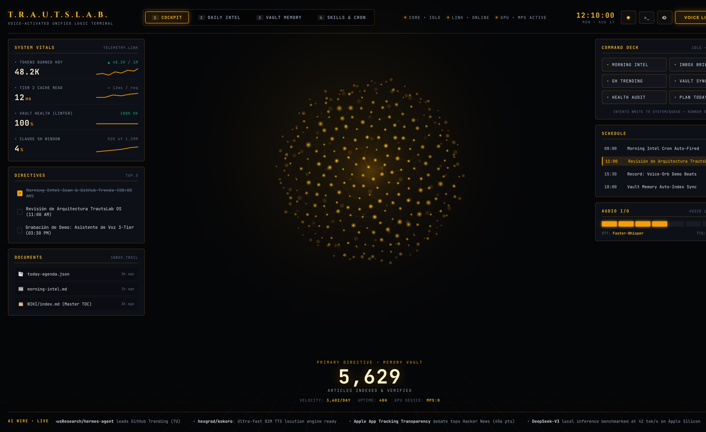
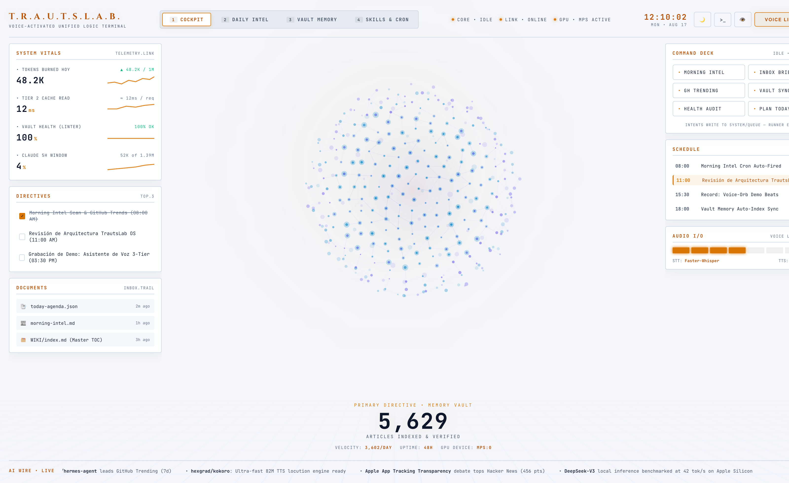
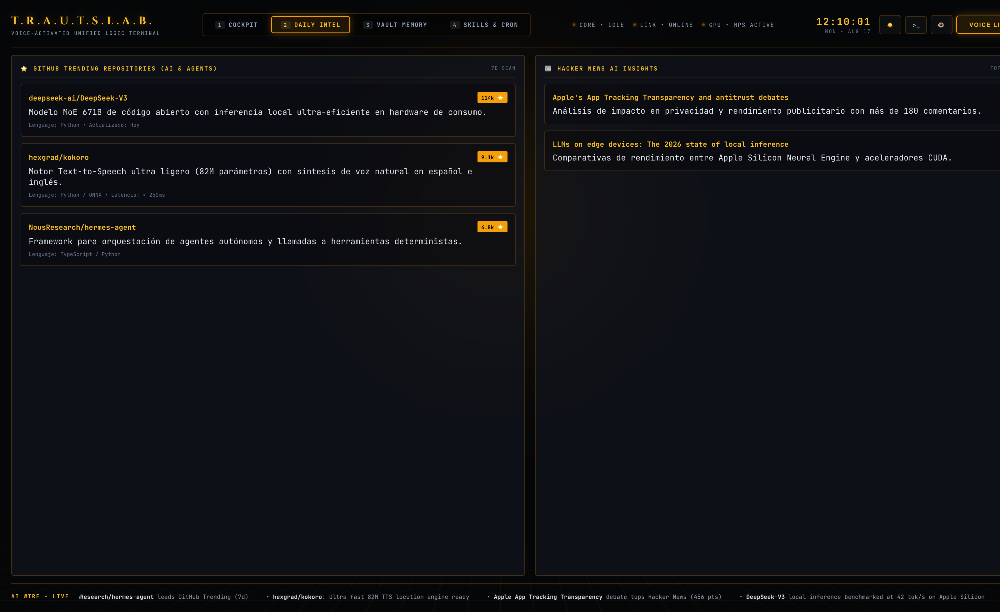
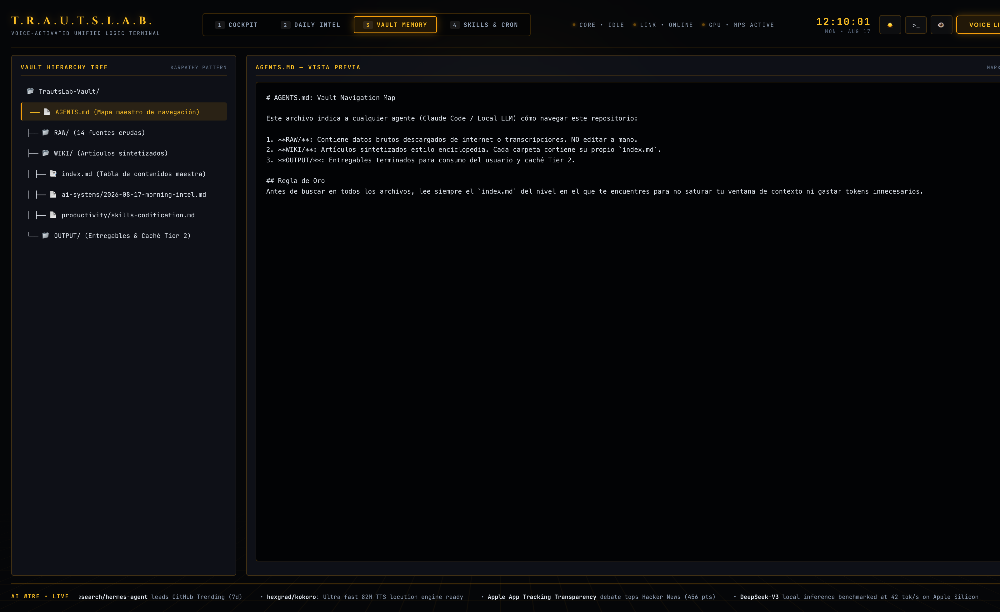
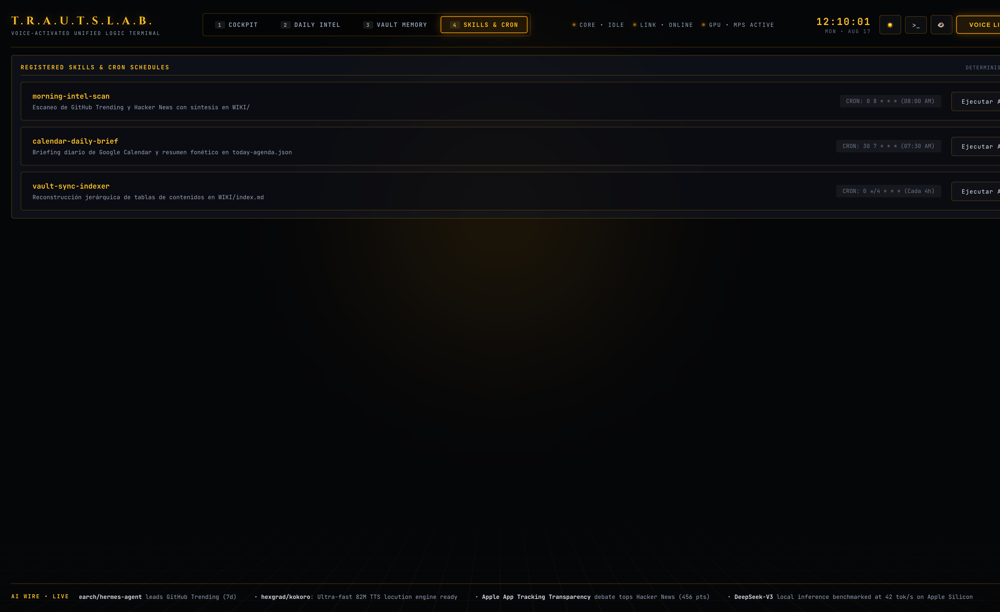
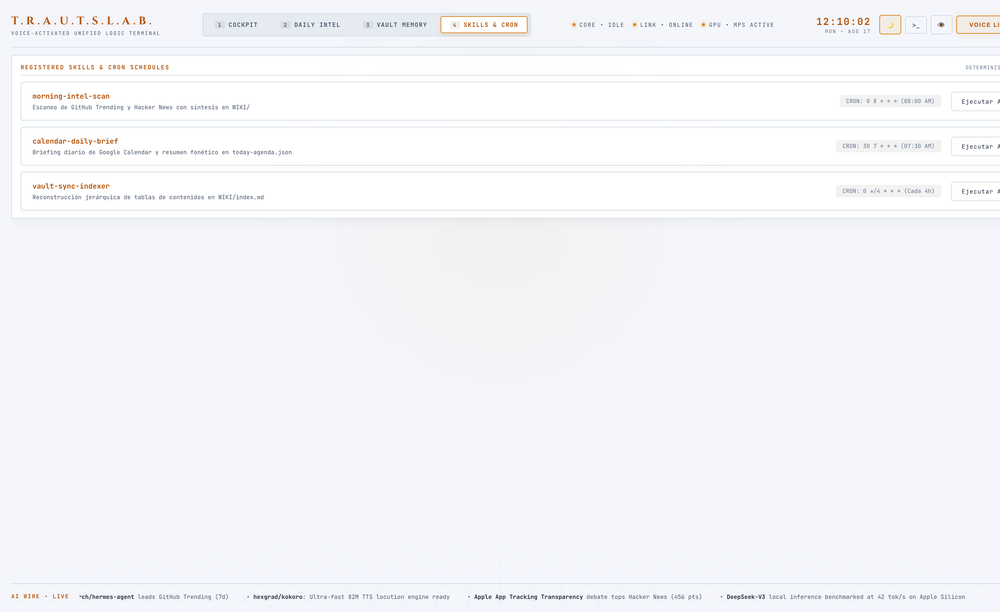

# TrautsLab OS — Informe de Verificación de Pestañas HUD (Modo Oscuro y Claro)

> **Documento:** `docs/testing/walkthrough.md`  
> **Proyecto:** TrautsLab OS  
> **Versión:** `v0.1.0-alpha.6`  
> **Fecha y Hora:** 2026-08-17 12:10:00 (PET / UTC-5 - Hora Perú)  
> **Navegador:** Google Chrome Desktop (`/Applications/Google Chrome.app`)  
> **Resolución de Prueba:** 1600x980 (HiDPI / Retina 2x)  

---

## 🎬 1. Galería de las 4 Pestañas en Modo Oscuro y Modo Claro

| 🌙 Pestaña 1: Cockpit 3D (Oscuro) | ☀️ Pestaña 1: Cockpit 3D (Claro) |
| :---: | :---: |
|  |  |

| 🌙 Pestaña 2: Daily Intel (Oscuro) | 🌙 Pestaña 3: Vault Memory (Oscuro) |
| :---: | :---: |
|  |  |

| 🌙 Pestaña 4: Skills & Cron (Oscuro) | ☀️ Pestaña 4: Skills & Cron (Claro) |
| :---: | :---: |
|  |  |

---

## 🎛️ 2. Verificación de Pestañas y Atajos de Teclado

| Pestaña | Atajo | Componente Activo | Estado en Modo Oscuro | Estado en Modo Claro |
| :---: | :---: | :--- | :---: | :---: |
| **`1 COCKPIT`** | `Tecla 1` | Esfera 3D de partículas, Vitals, Directivas y Command Deck | ✅ Activo (Amber Glow) | ✅ Activo (Porcelain & Slate) |
| **`2 DAILY INTEL`** | `Tecla 2` | Feed de repositorios GitHub Trending (7d) y Hacker News | ✅ Activo (Amber Cards) | ✅ Activo (White Slate Cards) |
| **`3 VAULT MEMORY`** | `Tecla 3` | Árbol interactivo del Vault y lector Markdown de notas | ✅ Activo (Tree + Reader) | ✅ Activo (Tree + Reader) |
| **`4 SKILLS & CRON`** | `Tecla 4` | Matriz de skills con cron schedules y ejecución manual | ✅ Activo (Runners OK) | ✅ Activo (Runners OK) |
