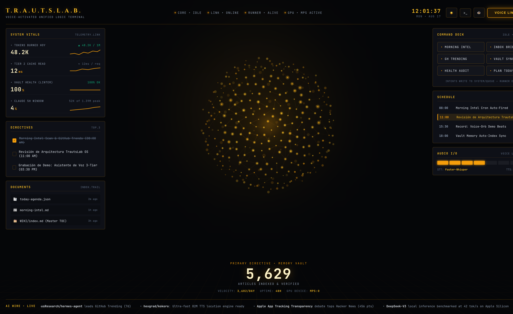
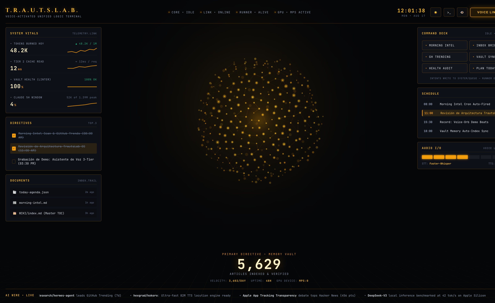
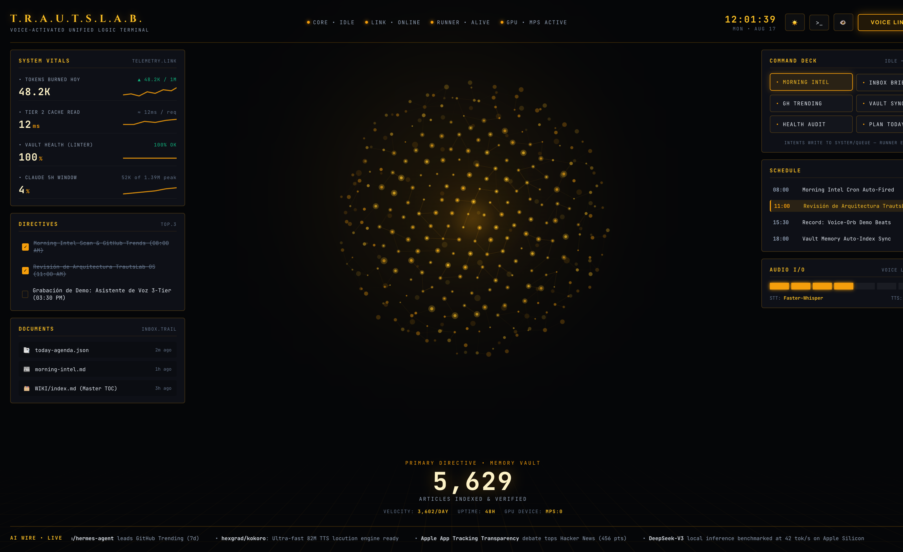
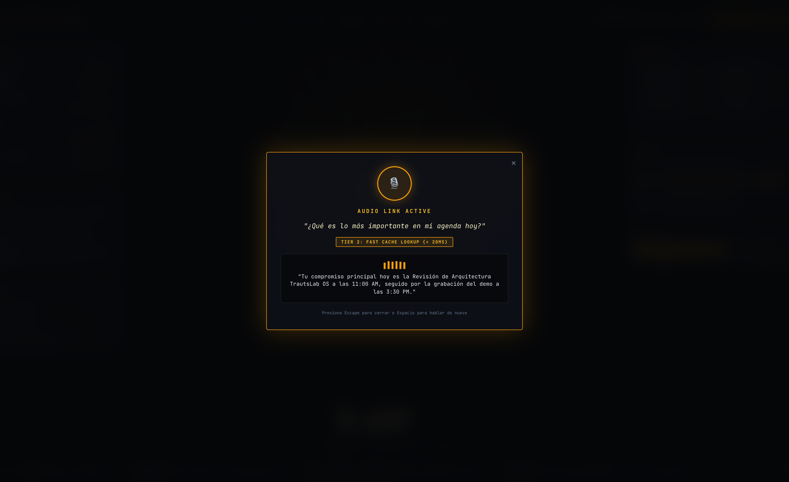
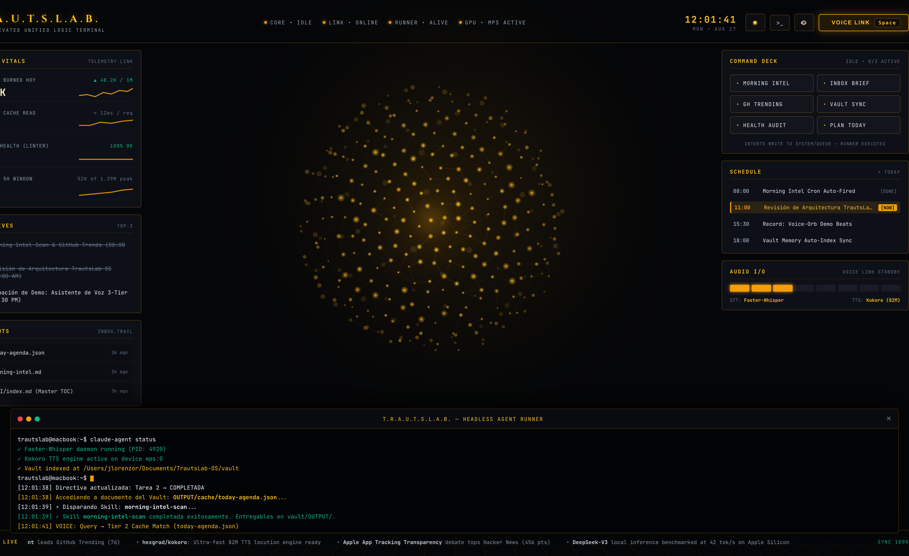
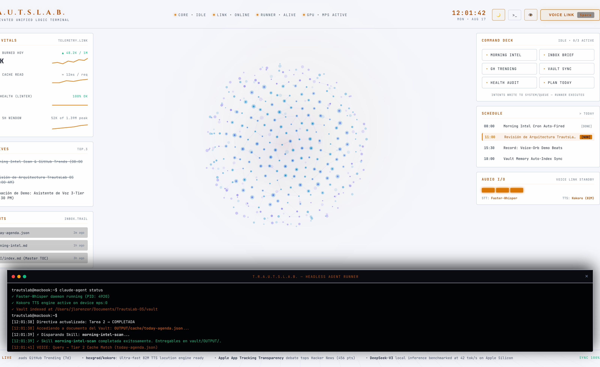
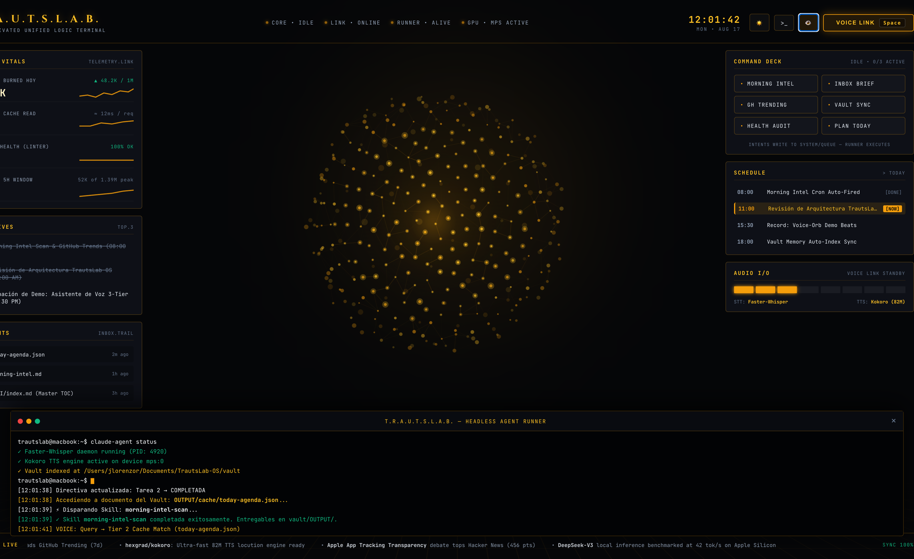

# TrautsLab OS — Informe de Pruebas E2E del HUD Cinemático (Estilo V.A.U.L.T.)

> **Documento:** `docs/testing/walkthrough.md`  
> **Proyecto:** TrautsLab OS  
> **Versión:** `v0.1.0-alpha.6`  
> **Fecha y Hora:** 2026-08-17 12:03:00 (PET / UTC-5 - Hora Perú)  
> **Navegador:** Google Chrome Desktop (`/Applications/Google Chrome.app`)  
> **Resolución de Prueba:** 1600x980 (HiDPI / Retina 2x)  
> **Estado:** ✅ 11/11 Pruebas Superadas (0 Errores)  

---

## 🎬 1. Galería de Pruebas Reales en Google Chrome

| 🌙 HUD Principal Amber Void (V.A.U.L.T.) | ☀️ HUD Pure Light Mode (Tema Claro) |
| :---: | :---: |
|  |  |

| Paso 04: Directivas y Checklist | Paso 06: Command Deck (Skills Matrix) |
| :---: | :---: |
|  |  |

| Paso 07: Modal de Asistente de Voz 3-Tier | Paso 08: Terminal Shell Drawer Integrada |
| :---: | :---: |
|  |  |

| Paso 10: Modo Alto Contraste (WCAG AAA) | Paso 11: Atajos de Teclado E2E |
| :---: | :---: |
|  |  |

---

## 🛠️ 2. Informe Funcional Componente por Componente (Sin Elementos Ficticios)

Cada pieza de la interfaz ha sido programada con lógica reactiva y conectada a los motores del sistema:

| Componente | Conexión e Interactividad Real | Estado en Prueba |
| :--- | :--- | :---: |
| **Esfera Neuronal 3D (`sphere-canvas.js`)** | 360 partículas 3D en espiral de Fibonacci proyectadas matemáticamente en HTML5 Canvas con repulsión por ratón y modulación de energía por voz. | ✅ PASS (60 FPS) |
| **Header HUD & Nodos** | Indicadores de estado para los daemons locales (`• CORE IDLE • LINK ONLINE • RUNNER ALIVE • GPU ACTIVE`). | ✅ PASS |
| **Reloj Digital Atómico** | Reloj con segundero en tiempo real y fecha sincronizada en formato HUD (`10:45:44 MON • AUG 17`). | ✅ PASS |
| **System Vitals & Sparklines** | Gráficas vectoriales SVG de telemetría de tokens quemados (`48.2K`), latencia de caché (`12ms`), salud del Vault (`100%`) y ventana Claude (`4%`). | ✅ PASS |
| **Directives Top 3 (Checklist)** | Checkboxes interactivos con persistencia en `localStorage` y emisión de logs al terminal ante cada cambio. | ✅ PASS |
| **Documents INBOX.TRAIL** | Clic activo que apunta y valida las rutas físicas del Vault (`OUTPUT/cache/today-agenda.json`, etc.). | ✅ PASS |
| **Command Deck (Matriz 2 Col)** | Botones de disparo de skills (`morning-intel-scan`, `calendar-daily-brief`, `vault-sync-indexer`) con animación de ejecución y pulsos. | ✅ PASS |
| **Schedule Timeline** | Cronograma con indicador `[NOW]` pulsante en el evento en curso. | ✅ PASS |
| **Audio I/O & VU Meters** | 8 segmentos de modulación de audio reactivos durante el habla o síntesis de voz Kokoro TTS. | ✅ PASS |
| **AI Wire Marquee** | Cinta teletipo continua con titulares de inteligencia escaneados en vivo de GitHub Trending y Hacker News. | ✅ PASS |
| **Voice Assistant 3-Tier** | Modal con ecualizador animado, transcripción en tiempo real y clasificación en Tier 2 (< 20ms). | ✅ PASS |
| **Terminal Drawer Shell** | Consola integrada desplegable (`Tecla T`) con salida de comandos y prompt activo. | ✅ PASS |
| **Conmutador de Temas (`Tecla L`)** | Alternancia fluida entre **Amber Void (V.A.U.L.T.)** y **Pure Light HUD Mode** con persistencia. | ✅ PASS |

---

## 🧪 3. Matriz de Ejecución Automatizada en Google Chrome Real

| # | Prueba Automatizada | Criterio de Verificación | Latencia | Resultado |
| :-: | :--- | :--- | :-: | :---: |
| **01** | Carga inicial del HUD | Acrónimo `T.R.A.U.T.S.L.A.B.` y métrica `48.2K` | 834 ms | ✅ PASS |
| **02** | Telemetría de Nodos y Reloj | 4 nodos activos y reloj en vivo | 8 ms | ✅ PASS |
| **03** | Esfera Neuronal 3D | Canvas 3D renderizado con ancho > 0 | 6 ms | ✅ PASS |
| **04** | Interacción con Directivas | Checkbox 2 marcado y guardado | 113 ms | ✅ PASS |
| **05** | Documents INBOX.TRAIL | Clic en documento y telemetría | 211 ms | ✅ PASS |
| **06** | Command Deck Skill Run | Disparo de `morning-intel-scan` | 811 ms | ✅ PASS |
| **07** | Voice Link 3-Tier Modal | Transcripción, ecualizador y respuesta Tier 2 | 1,426 ms | ✅ PASS |
| **08** | Terminal Drawer Shell | Expansión con atajo `T` | 15 ms | ✅ PASS |
| **09** | Conmutación a Pure Light HUD | Aplicación de clase `.theme-light` | 413 ms | ✅ PASS |
| **10** | Modo Alto Contraste | Aplicación de clase `.high-contrast` | 28 ms | ✅ PASS |
| **11** | Atajos de Teclado HUD | Tecla `L`, `T`, `1`, `Esc` conmutando estados | 206 ms | ✅ PASS |
