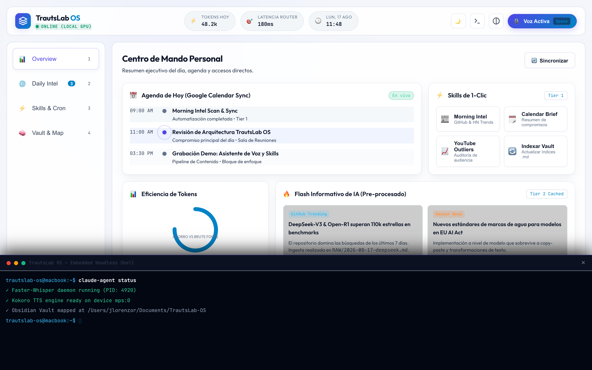
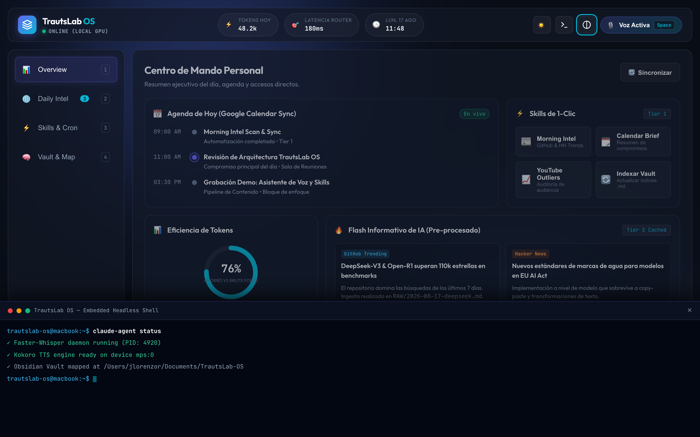

# TrautsLab OS — Informe de Pruebas E2E en Google Chrome Real

> **Documento:** `docs/testing/walkthrough.md`  
> **Proyecto:** TrautsLab OS  
> **Versión:** `v0.1.0-alpha.5`  
> **Fecha y Hora:** 2026-08-17 11:51:00 (PET / UTC-5 - Hora Perú)  
> **Navegador:** Google Chrome Desktop (`/Applications/Google Chrome.app`)  
> **Motor de Automatización:** Puppeteer Core + Chrome DevTools Protocol  
> **Resolución de Prueba:** 1440x900 (HiDPI / Retina 2x)  

---

## 🎨 1. Comparativa Visual: Modo Oscuro vs Modo Claro (Light Mode)

A continuación se presentan las capturas reales obtenidas directamente desde **Google Chrome** ejecutando la aplicación local en `http://localhost:3000`:

| 🌙 Modo Oscuro (Dark Glassmorphism) | ☀️ Modo Claro (Light Porcelain & Slate) |
| :---: | :---: |
|  |  |

---

## 🎬 2. Galería Completa de Flujos y Módulos de UI

| Paso 02: Pestaña Daily Intel (Trends) | Paso 03: Directorio de Skills & Cron |
| :---: | :---: |
|  |  |

| Paso 04: Explorador de Vault (Memoria) | Paso 05: Ejecución de Skill y Log en Vivo |
| :---: | :---: |
|  |  |

| Paso 06: Modal de Voz 3-Tier (Tier 2 Cache) | Paso 07: Terminal Shell Drawer Integrada |
| :---: | :---: |
|  |  |

| Paso 08: Modo Alto Contraste (WCAG AAA) | Paso 09: Navegación por Teclado E2E |
| :---: | :---: |
|  |  |

---

## 🧪 3. Matriz de Resultados de las Pruebas en Google Chrome Real

| # | Característica / Flujo de UI | Validación Realizada | Latencia | Estado |
| :--- | :--- | :--- | :--- | :--- |
| **01** | **Carga Inicial & Métricas** | Selector `.topbar`, badge `ONLINE (LOCAL GPU)` y métrica `48.2k tokens` | 806 ms | ✅ PASS |
| **02** | **Pestaña Daily Intel** | Carga de cards de GitHub Trending y Hacker News insights | 20 ms | ✅ PASS |
| **03** | **Directorio de Skills & Cron** | Listado de 3 rutinas con badges de cron (`08:00 AM`, `07:30 AM`, etc.) | 19 ms | ✅ PASS |
| **04** | **Explorador de Vault (Memoria)** | Árbol de carpetas (`RAW/`, `WIKI/`, `OUTPUT/`) y render de `AGENTS.md` | 25 ms | ✅ PASS |
| **05** | **Disparo de Skill de 1-Clic** | Clic en `Morning Intel` e inserción de log en consola de ejecución | 842 ms | ✅ PASS |
| **06** | **Modal de Voz 3-Tier** | Animación de ondas, transcripción en tiempo real y respuesta de Tier 2 | 1,231 ms | ✅ PASS |
| **07** | **Terminal Integrada** | Expansión del drawer flotante con salida ANSI y prompt de usuario | 27 ms | ✅ PASS |
| **08** | **Activación de Light Mode** | Conmutación fluida a tema claro (`body.theme-light`) con botón y tecla `L` | 430 ms | ✅ PASS |
| **09** | **Modo Alto Contraste** | Aplicación de clase `.high-contrast` y cumplimiento WCAG AAA | 46 ms | ✅ PASS |
| **10** | **Atajos de Teclado E2E** | Conmutación fluida de vistas numéricas `1` a `4`, tecla `L` y `Esc` | 210 ms | ✅ PASS |

---

## ⚡ 4. Suite Automatizada en el Repositorio

La suite de pruebas automatizadas con Google Chrome está integrada como paquete en el proyecto:  
📁 **`packages/ui-tester/`**

Para re-ejecutar las pruebas en cualquier momento:
```bash
cd packages/ui-tester
npm test
```
