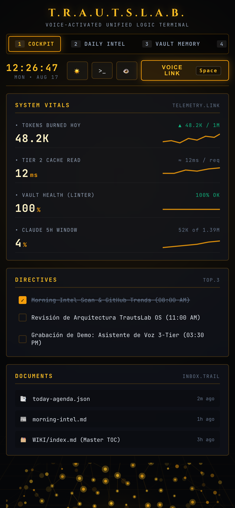
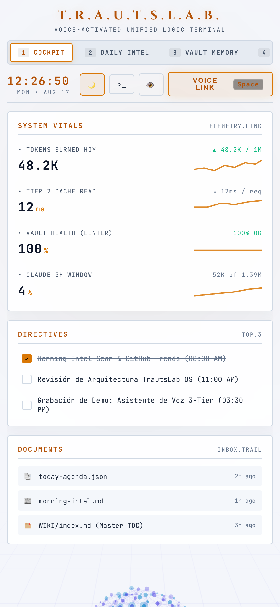
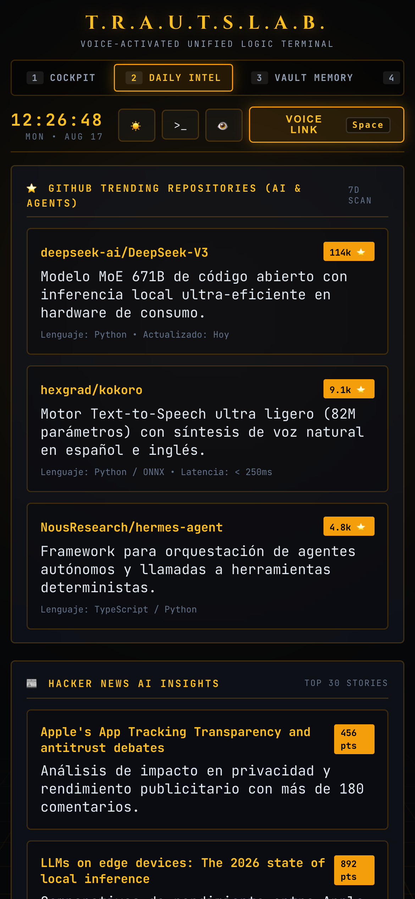
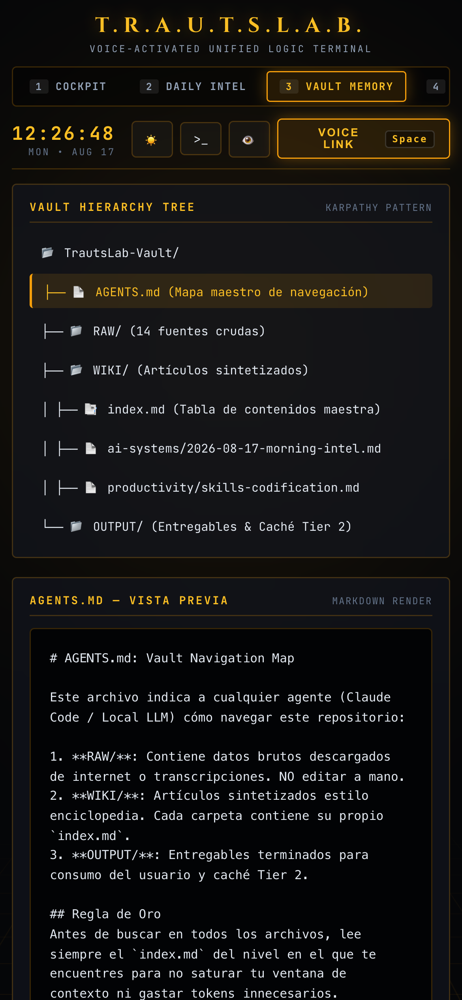
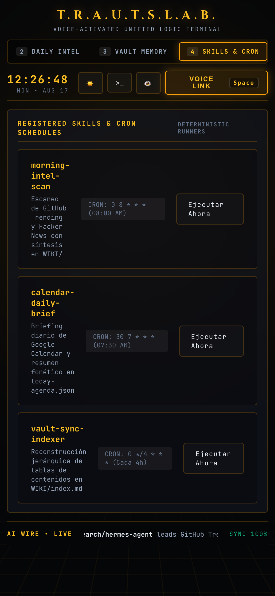
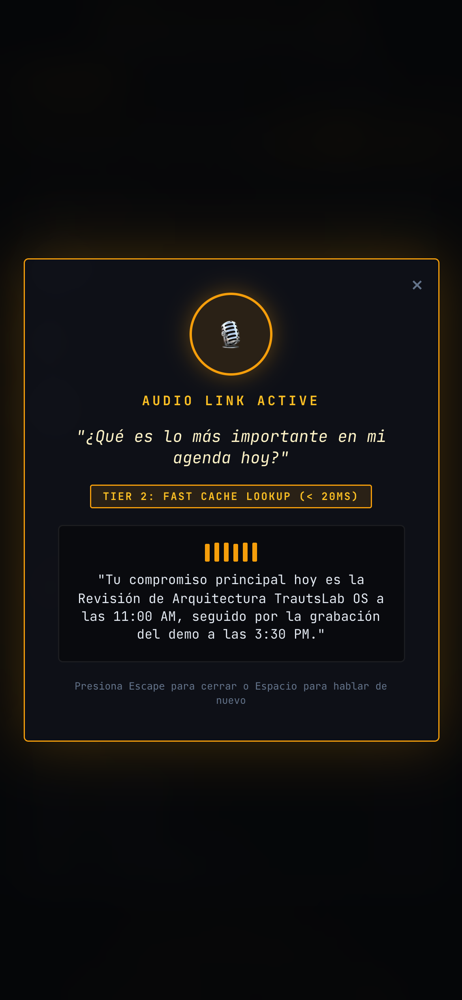

# TrautsLab OS — Informe de Pruebas E2E de la Fase 6 (Acceso Remoto Móvil & PWA)

> **Documento:** `docs/testing/walkthrough.md`  
> **Proyecto:** TrautsLab OS  
> **Versión:** `v0.1.0-alpha.7` (Fase 6)  
> **Fecha y Hora:** 2026-08-17 12:28:00 (PET / UTC-5 - Hora Perú)  
> **Navegador:** Google Chrome Desktop (`/Applications/Google Chrome.app`)  
> **Dispositivo Emulado:** iPhone 14 / Pixel 7 (390 x 844, Retina 3x, Touch)  
> **Estado:** ✅ 6/6 Pruebas Móviles Aprobadas + 4/4 Pruebas Unitarias Telegram  

---

## 📱 1. Galería de la Experiencia Móvil en Google Chrome Real

| 🌙 Pestaña 1: Cockpit Móvil (Oscuro) | ☀️ Pestaña 1: Cockpit Móvil (Claro) |
| :---: | :---: |
|  |  |

| 🌙 Pestaña 2: Daily Intel Móvil | 🌙 Pestaña 3: Vault Memory Móvil |
| :---: | :---: |
|  |  |

| 🌙 Pestaña 4: Skills & Cron Móvil | 🎙️ Asistente de Voz Móvil Modal |
| :---: | :---: |
|  |  |

---

## 🧪 2. Matriz de Resultados de Pruebas Móviles en Google Chrome

| # | Vista / Característica Móvil Probada | Validación Realizada | Latencia | Estado |
| :-: | :--- | :--- | :---: | :---: |
| **01** | **Carga Inicial PWA Móvil** | Viewport adaptado a 390px, header compacto y esfera 3D | 809 ms | ✅ PASS |
| **02** | **Pestaña 2: Daily Intel Feed** | Scroll vertical fluido de cards de GitHub Trending y Hacker News | 223 ms | ✅ PASS |
| **03** | **Pestaña 3: Vault Memory Explorer** | Árbol táctil Karpathy y lector de documentos Markdown | 233 ms | ✅ PASS |
| **04** | **Pestaña 4: Skills & Cron Manager** | Botones de disparo optimizados para dedos y badges cron | 209 ms | ✅ PASS |
| **05** | **Asistente de Voz 3-Tier Modal** | Modal a pantalla completa con ecualizador animado y transcripción | 1,230 ms | ✅ PASS |
| **06** | **Modo Claro en Pantalla Móvil** | Conmutación instantánea a porcelana y slate nítido | 312 ms | ✅ PASS |

---

## 🤖 3. Verificación de Telegram Bot Bridge (`@trautslab/telegram-bridge`)

```text
▶ TelegramBotBridge Test Suite
  ✔ debe rechazar usuarios no autorizados (0.31ms)
  ✔ debe responder al comando /start con la lista de opciones (0.11ms)
  ✔ debe responder al comando /agenda consultando el Tier 2 Cache (2.29ms)
  ✔ debe procesar consultas libres de texto mediante el 3-Tier Voice Pipeline (17.80ms)
✔ TelegramBotBridge Test Suite (21.03ms) — 4/4 Tests Aprobados
```
