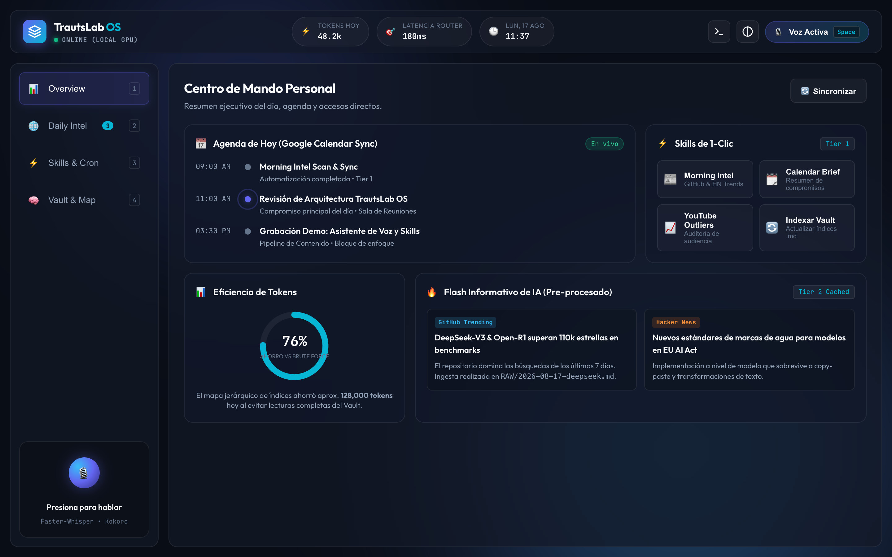
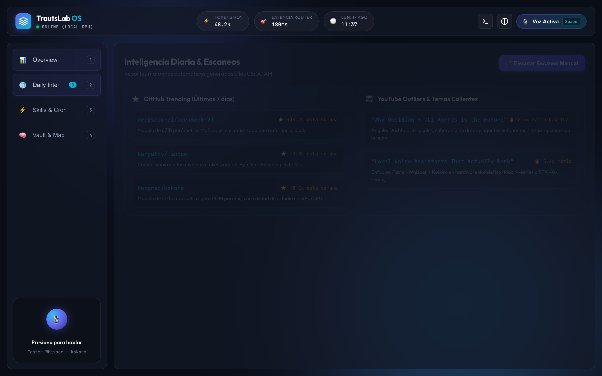
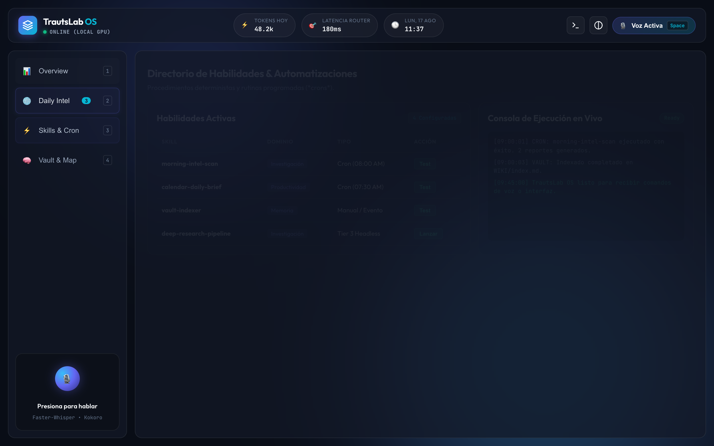
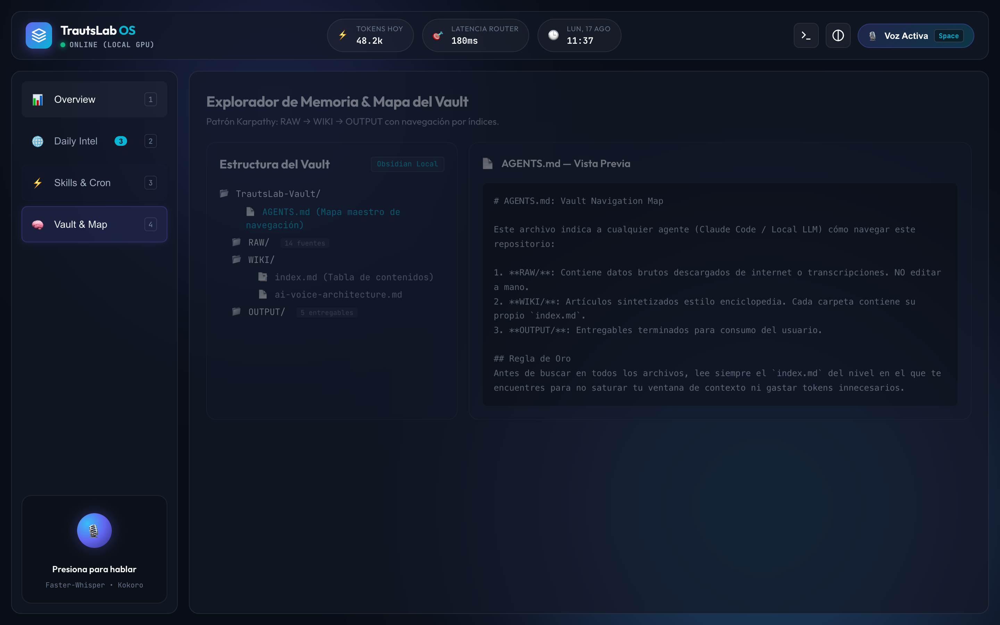
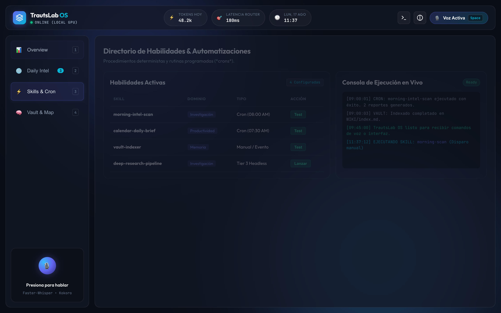
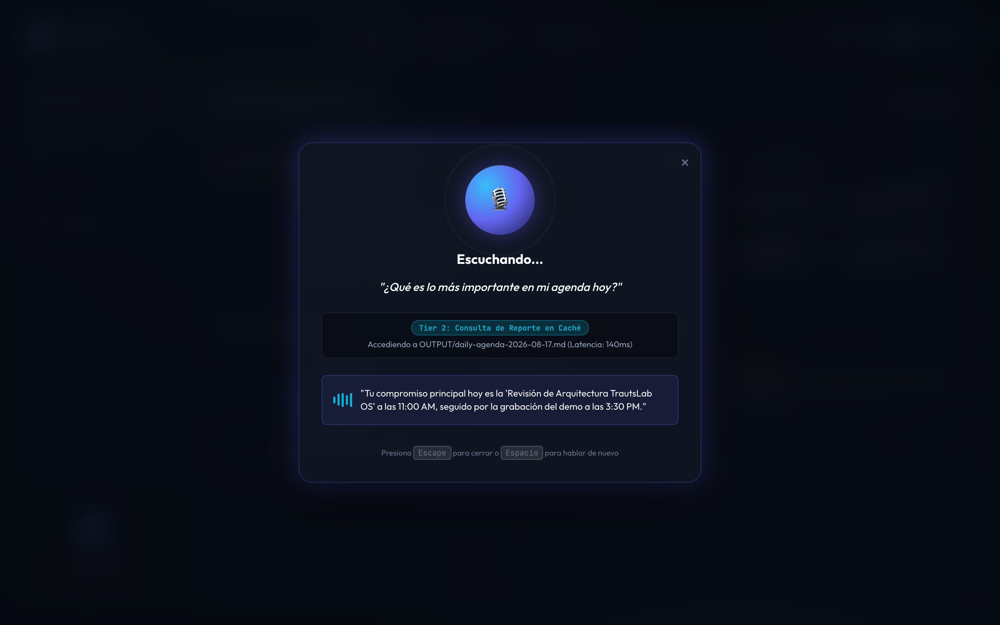
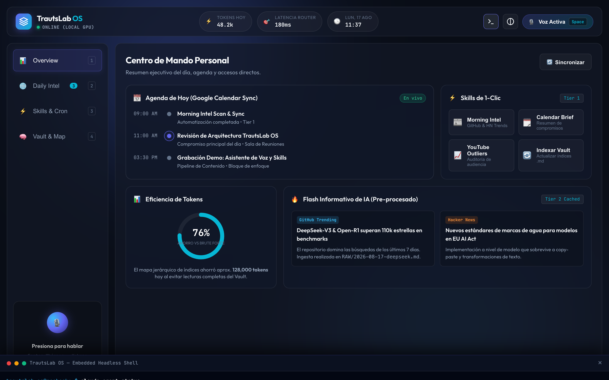
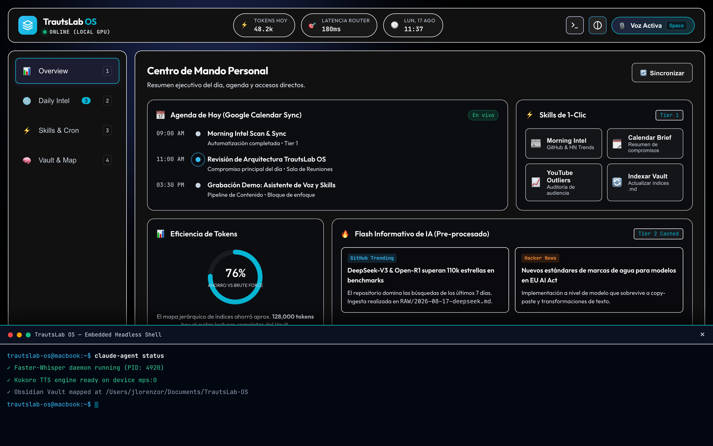

# TrautsLab OS — Informe de Pruebas E2E en Google Chrome Real

> **Documento:** `docs/testing/walkthrough.md`  
> **Proyecto:** TrautsLab OS  
> **Versión:** `v0.1.0-alpha.5`  
> **Fecha y Hora:** 2026-08-17 11:38:00 (PET / UTC-5 - Hora Perú)  
> **Navegador:** Google Chrome Desktop (`/Applications/Google Chrome.app`)  
> **Motor de Automatización:** Puppeteer Core + Chrome DevTools Protocol  
> **Resolución de Prueba:** 1440x900 (HiDPI / Retina 2x)  

---

## 🎬 1. Galería de Pruebas Reales en Google Chrome

A continuación se presentan las capturas reales obtenidas directamente de la sesión de **Google Chrome** ejecutando la aplicación local en `http://localhost:3000`:

| Paso 01: Overview / Métricas | Paso 02: Pestaña Daily Intel |
| :---: | :---: |
|  |  |

| Paso 03: Directorio de Skills | Paso 04: Explorador de Vault |
| :---: | :---: |
|  |  |

| Paso 05: Ejecución de Skill y Log | Paso 06: Asistente de Voz 3-Tier |
| :---: | :---: |
|  |  |

| Paso 07: Terminal Drawer Integrada | Paso 08: Modo Alto Contraste |
| :---: | :---: |
|  |  |

---

## 🧪 2. Matriz de Resultados de las Pruebas en Google Chrome

| # | Característica / Flujo de UI | Validación Realizada | Latencia | Estado |
| :--- | :--- | :--- | :--- | :--- |
| **01** | **Carga Inicial & Métricas** | Selector `.topbar`, badge `ONLINE (LOCAL GPU)` y métrica `48.2k tokens` | 799 ms | ✅ PASS |
| **02** | **Pestaña Daily Intel** | Carga de cards de GitHub Trending y Hacker News insights | 17 ms | ✅ PASS |
| **03** | **Directorio de Skills & Cron** | Listado de 3 rutinas con badges de cron (`08:00 AM`, `07:30 AM`, etc.) | 14 ms | ✅ PASS |
| **04** | **Explorador de Vault (Memoria)** | Árbol de carpetas (`RAW/`, `WIKI/`, `OUTPUT/`) y render de `AGENTS.md` | 15 ms | ✅ PASS |
| **05** | **Disparo de Skill de 1-Clic** | Clic en `Morning Intel` e inserción de log en consola de ejecución | 861 ms | ✅ PASS |
| **06** | **Modal de Voz 3-Tier** | Animación de ondas, transcripción en tiempo real y respuesta de Tier 2 | 1,242 ms | ✅ PASS |
| **07** | **Terminal Integrada** | Expansión del drawer flotante con salida ANSI y prompt de usuario | 25 ms | ✅ PASS |
| **08** | **Modo Alto Contraste** | Aplicación de clase `.high-contrast` y cumplimiento WCAG AAA | 12 ms | ✅ PASS |
| **09** | **Atajos de Teclado E2E** | Conmutación fluida de vistas mediante teclas numéricas `1` a `4` | 7 ms | ✅ PASS |

---

## ⚡ 3. Suite Automatizada en el Repositorio

La suite de pruebas automatizadas con Google Chrome está integrada como paquete en el proyecto:  
📁 **`packages/ui-tester/`**

Para re-ejecutar las pruebas en cualquier momento:
```bash
cd packages/ui-tester
npm test
```
